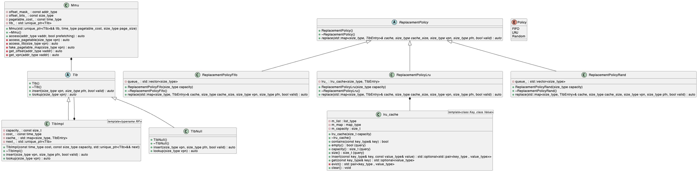

# Final Mastery

## Presentation

- [First Presentation](https://docs.google.com/presentation/d/1CV-jNDPL3-2YAILafnv3fhBJPk7_XjFXYFrBWaoiAPU/edit?usp=sharing)

I designed the overall topics of our first presentation, and I also designed the following sections of the presentation below:

1. Simulation: User Space Memory Management
2. Simulation: Locks & Synchronization with Threading
3. Simulation: SMP Bus Contention & Arbitration
4. Simulation: Swap System
5. Simulation: User Space Paging System

Although these are the conceptual designs, they have detailed parameter definitions.

- [Refined Presentation](https://docs.google.com/presentation/d/1cqL5pHquOcsk4v-Pn6lAISUzBKTm0BOb61Xs_q1OGuA/edit?usp=sharing)
- [Final Presentation](https://docs.google.com/presentation/d/1IVi1K4gROPD1z8eB5QqwAMphA0JHd5xxJ-XFRLI7p3g/edit?usp=sharing)

We developed the final presentation from the refined one.

I designed the overall topics of the refined and final ones as well. My contributions in these two include the following sections:

1. TLB Warming (developed from Zack's idea)
2. TLB Warming for App Launch
3. TLB Warming by Prefetching
4. Simulator Design & Implementation

## Design



For the final simulator design, I want to highlight some of the key features it has:

1. TLB prefetching simulation (warming)
2. Any levels of TLBs, thanks to the recursive definition of the TLB class
3. Different replacement policies for different TLBs with FIFO, RAND and LRU supported currently and easy to add new ones without modification of the TLB class, thanks to the Strategy design pattern used in the implementation
4. Fine-grained measurements for TLB hit/miss cost with page-table accessing estimation

## Implementation

Please see my projects in C++ on GitHub for learning the VMM part and also supporting our presentations:

- [TLB](https://github.com/hankbaoneu/cs5600-tlb)
- [Malloc](https://github.com/hankbaoneu/cs5600-malloc)

## Examples

### Usage

```zsh
./tlb -h
Usage: tlb [OPTIONS]...

Supported options:
-s, --size=PAGESIZE
	size of a page in bytes, must be a power of 2, default to 4096
-t, --tlb=TLBSIZE
	size of the TLB L1, default to 64
-c, --cost=TLBCOST
	cost of lookup in the TLB L1, default to 5 nano seconds
-l, --tlb2=TLBSIZE2
	size of the TLB L2, disable by setting to 0, default to 0
-d, --cost2=TLBCOST2
	cost of lookup in the TLB L2, default to 20 nano seconds
-e, --costpt=PTBCOST
	cost of lookup in the Page Table, default to 100 nano seconds
-p, --policy=TLBPOLICY
	replacement policy for TLB L1 (FIFO, LRU, RAND), default to FIFO
-q, --policy2=TLBPOLICY2
	replacement policy for TLB L2 (FIFO, LRU, RAND), default to LRU
-a, --access=ADDRLIST
	a set of comma-separated addresses to access, required
-f, --prefetch=PREFETCHLIST
	a set of comma-separated addresses to prefetch, default to none
-h, --help
	print usage message and exit
```

### Prefetching Disabled

```zsh
$ ./tlb -a 0x1000,0x2000,0x3000,0x4000
page_size: 4096
tlb_size: 64
tlb_cost: 5
tlb_l2_size: 0
tlb_l2_cost: 20
pagetable_cost: 100
tlb_policy: FIFO
tlb_l2_policy: LRU
access: 0x1000,0x2000,0x3000,0x4000
prefetch: <empty>

MMU access: MISS, VADDR=0x00001000, VPN=1, OFFSET=0x00000000, PFN=8193, PADDR=0x80000000 COST=100ns
MMU access: MISS, VADDR=0x00002000, VPN=2, OFFSET=0x00000000, PFN=8194, PADDR=0x00000000 COST=100ns
MMU access: MISS, VADDR=0x00003000, VPN=3, OFFSET=0x00000000, PFN=8195, PADDR=0x80000000 COST=100ns
MMU access: MISS, VADDR=0x00004000, VPN=4, OFFSET=0x00000000, PFN=8196, PADDR=0x00000000 COST=100ns

FINALSTATS hits 0, misses 4, hitrate 0.00, total cost 400ns, average cost 100.00ns
```

### Prefetching Enabled

```zsh
$ ./tlb -a 0x1000,0x2000,0x3000,0x4000 -f 0x1000,0x2000,0x3000,0x4000
page_size: 4096
tlb_size: 64
tlb_cost: 5
tlb_l2_size: 0
tlb_l2_cost: 20
pagetable_cost: 100
tlb_policy: FIFO
tlb_l2_policy: LRU
access: 0x1000,0x2000,0x3000,0x4000
prefetch: 0x1000,0x2000,0x3000,0x4000

TLB prefetch: MISS, VADDR=0x00001000, VPN=1, PFN=8193
TLB prefetch: MISS, VADDR=0x00002000, VPN=2, PFN=8194
TLB prefetch: MISS, VADDR=0x00003000, VPN=3, PFN=8195
TLB prefetch: MISS, VADDR=0x00004000, VPN=4, PFN=8196
MMU access: HIT, VADDR=0x00001000, VPN=1, OFFSET=0x00000000, PFN=8193, PADDR=0x80000000 COST=5ns
MMU access: HIT, VADDR=0x00002000, VPN=2, OFFSET=0x00000000, PFN=8194, PADDR=0x00000000 COST=5ns
MMU access: HIT, VADDR=0x00003000, VPN=3, OFFSET=0x00000000, PFN=8195, PADDR=0x80000000 COST=5ns
MMU access: HIT, VADDR=0x00004000, VPN=4, OFFSET=0x00000000, PFN=8196, PADDR=0x00000000 COST=5ns

FINALSTATS hits 4, misses 0, hitrate 1.00, total cost 20ns, average cost 5.00ns
```
