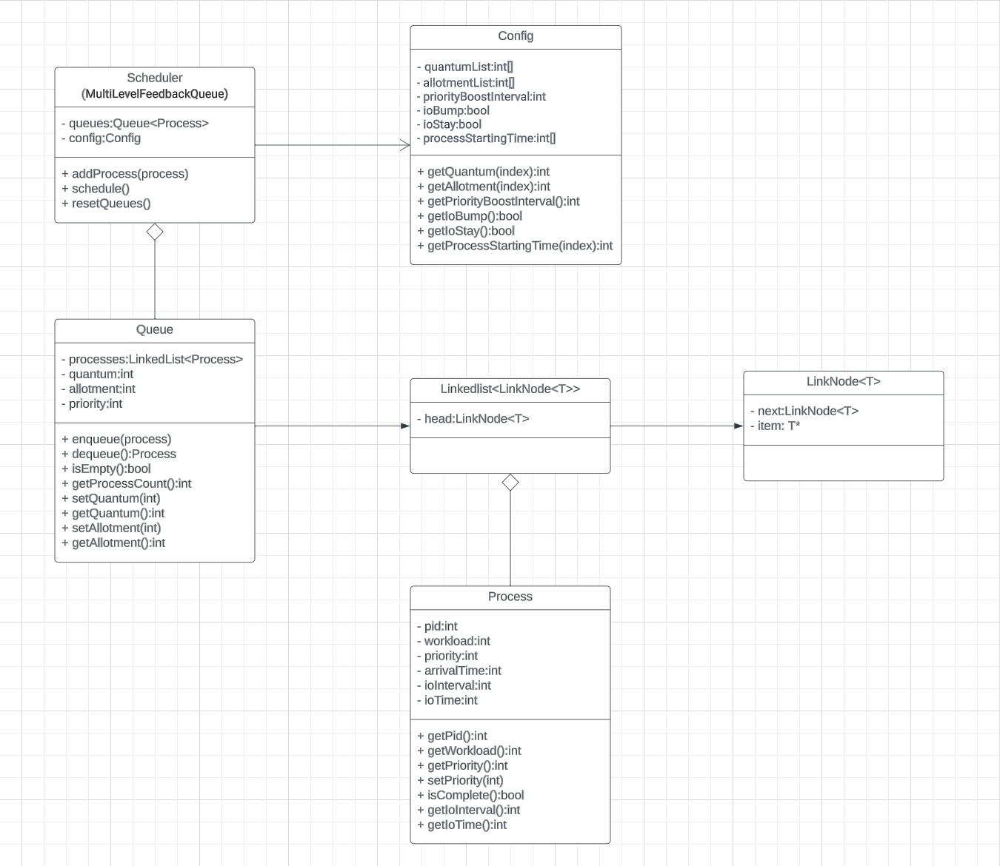
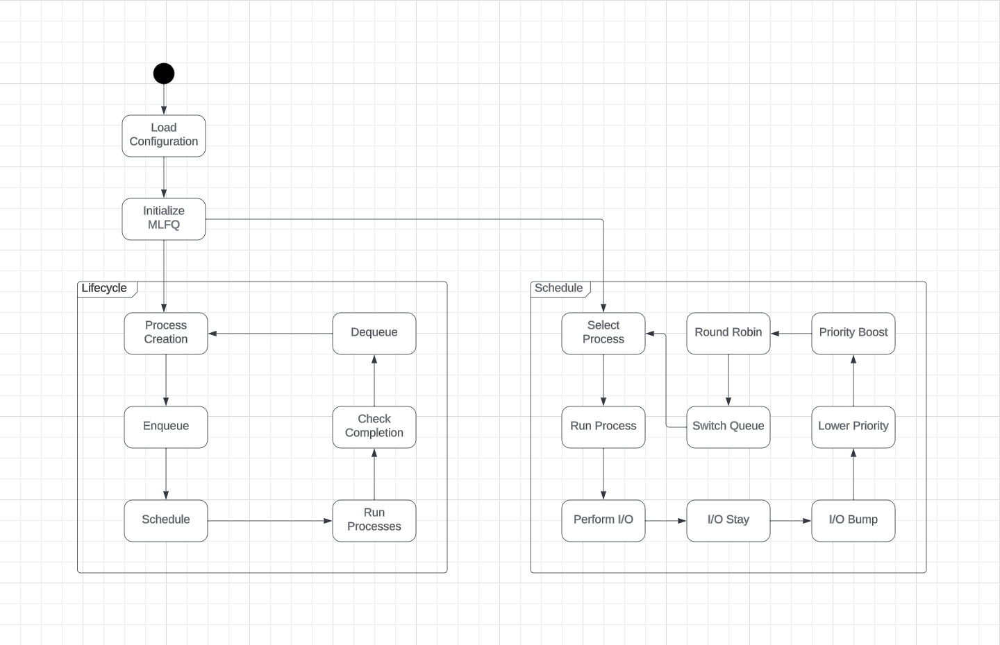

# Homework 3

## Part 1:  Chapter 8 Simulation

**Q1**: Run a few randomly-generated problems with just two jobs and two queues; compute the MLFQ execution trace for each. Make your life easier by limiting the length of each job and turning off I/Os.

**A**:

```zsh
$ python mlfq.py -n 2 -l 0,10,0:5,10,0 -c
Here is the list of inputs:
OPTIONS jobs 2
OPTIONS queues 2
OPTIONS allotments for queue  1 is   1
OPTIONS quantum length for queue  1 is  10
OPTIONS allotments for queue  0 is   1
OPTIONS quantum length for queue  0 is  10
OPTIONS boost 0
OPTIONS ioTime 5
OPTIONS stayAfterIO False
OPTIONS iobump False


For each job, three defining characteristics are given:
  startTime : at what time does the job enter the system
  runTime   : the total CPU time needed by the job to finish
  ioFreq    : every ioFreq time units, the job issues an I/O
              (the I/O takes ioTime units to complete)

Job List:
  Job  0: startTime   0 - runTime  10 - ioFreq   0
  Job  1: startTime   5 - runTime  10 - ioFreq   0


Execution Trace:

[ time 0 ] JOB BEGINS by JOB 0
[ time 0 ] Run JOB 0 at PRIORITY 1 [ TICKS 9 ALLOT 1 TIME 9 (of 10) ]
[ time 1 ] Run JOB 0 at PRIORITY 1 [ TICKS 8 ALLOT 1 TIME 8 (of 10) ]
[ time 2 ] Run JOB 0 at PRIORITY 1 [ TICKS 7 ALLOT 1 TIME 7 (of 10) ]
[ time 3 ] Run JOB 0 at PRIORITY 1 [ TICKS 6 ALLOT 1 TIME 6 (of 10) ]
[ time 4 ] Run JOB 0 at PRIORITY 1 [ TICKS 5 ALLOT 1 TIME 5 (of 10) ]
[ time 5 ] JOB BEGINS by JOB 1
[ time 5 ] Run JOB 0 at PRIORITY 1 [ TICKS 4 ALLOT 1 TIME 4 (of 10) ]
[ time 6 ] Run JOB 0 at PRIORITY 1 [ TICKS 3 ALLOT 1 TIME 3 (of 10) ]
[ time 7 ] Run JOB 0 at PRIORITY 1 [ TICKS 2 ALLOT 1 TIME 2 (of 10) ]
[ time 8 ] Run JOB 0 at PRIORITY 1 [ TICKS 1 ALLOT 1 TIME 1 (of 10) ]
[ time 9 ] Run JOB 0 at PRIORITY 1 [ TICKS 0 ALLOT 1 TIME 0 (of 10) ]
[ time 10 ] FINISHED JOB 0
[ time 10 ] Run JOB 1 at PRIORITY 1 [ TICKS 9 ALLOT 1 TIME 9 (of 10) ]
[ time 11 ] Run JOB 1 at PRIORITY 1 [ TICKS 8 ALLOT 1 TIME 8 (of 10) ]
[ time 12 ] Run JOB 1 at PRIORITY 1 [ TICKS 7 ALLOT 1 TIME 7 (of 10) ]
[ time 13 ] Run JOB 1 at PRIORITY 1 [ TICKS 6 ALLOT 1 TIME 6 (of 10) ]
[ time 14 ] Run JOB 1 at PRIORITY 1 [ TICKS 5 ALLOT 1 TIME 5 (of 10) ]
[ time 15 ] Run JOB 1 at PRIORITY 1 [ TICKS 4 ALLOT 1 TIME 4 (of 10) ]
[ time 16 ] Run JOB 1 at PRIORITY 1 [ TICKS 3 ALLOT 1 TIME 3 (of 10) ]
[ time 17 ] Run JOB 1 at PRIORITY 1 [ TICKS 2 ALLOT 1 TIME 2 (of 10) ]
[ time 18 ] Run JOB 1 at PRIORITY 1 [ TICKS 1 ALLOT 1 TIME 1 (of 10) ]
[ time 19 ] Run JOB 1 at PRIORITY 1 [ TICKS 0 ALLOT 1 TIME 0 (of 10) ]
[ time 20 ] FINISHED JOB 1

Final statistics:
  Job  0: startTime   0 - response   0 - turnaround  10
  Job  1: startTime   5 - response   5 - turnaround  15

  Avg  1: startTime n/a - response 2.50 - turnaround 12.50
```

```zsh
$ python mlfq.py -n 2 -j 2 -s 30 -M 0 -m 10 -c
Here is the list of inputs:
OPTIONS jobs 2
OPTIONS queues 2
OPTIONS allotments for queue  1 is   1
OPTIONS quantum length for queue  1 is  10
OPTIONS allotments for queue  0 is   1
OPTIONS quantum length for queue  0 is  10
OPTIONS boost 0
OPTIONS ioTime 5
OPTIONS stayAfterIO False
OPTIONS iobump False


For each job, three defining characteristics are given:
  startTime : at what time does the job enter the system
  runTime   : the total CPU time needed by the job to finish
  ioFreq    : every ioFreq time units, the job issues an I/O
              (the I/O takes ioTime units to complete)

Job List:
  Job  0: startTime   0 - runTime   5 - ioFreq   0
  Job  1: startTime   0 - runTime   1 - ioFreq   0


Execution Trace:

[ time 0 ] JOB BEGINS by JOB 0
[ time 0 ] JOB BEGINS by JOB 1
[ time 0 ] Run JOB 0 at PRIORITY 1 [ TICKS 9 ALLOT 1 TIME 4 (of 5) ]
[ time 1 ] Run JOB 0 at PRIORITY 1 [ TICKS 8 ALLOT 1 TIME 3 (of 5) ]
[ time 2 ] Run JOB 0 at PRIORITY 1 [ TICKS 7 ALLOT 1 TIME 2 (of 5) ]
[ time 3 ] Run JOB 0 at PRIORITY 1 [ TICKS 6 ALLOT 1 TIME 1 (of 5) ]
[ time 4 ] Run JOB 0 at PRIORITY 1 [ TICKS 5 ALLOT 1 TIME 0 (of 5) ]
[ time 5 ] FINISHED JOB 0
[ time 5 ] Run JOB 1 at PRIORITY 1 [ TICKS 9 ALLOT 1 TIME 0 (of 1) ]
[ time 6 ] FINISHED JOB 1

Final statistics:
  Job  0: startTime   0 - response   0 - turnaround   5
  Job  1: startTime   0 - response   5 - turnaround   6

  Avg  1: startTime n/a - response 2.50 - turnaround 5.50
```

```zsh
python mlfq.py -n 2 -j 2 -s 22 -M 0 -m 10 -c
Here is the list of inputs:
OPTIONS jobs 2
OPTIONS queues 2
OPTIONS allotments for queue  1 is   1
OPTIONS quantum length for queue  1 is  10
OPTIONS allotments for queue  0 is   1
OPTIONS quantum length for queue  0 is  10
OPTIONS boost 0
OPTIONS ioTime 5
OPTIONS stayAfterIO False
OPTIONS iobump False


For each job, three defining characteristics are given:
  startTime : at what time does the job enter the system
  runTime   : the total CPU time needed by the job to finish
  ioFreq    : every ioFreq time units, the job issues an I/O
              (the I/O takes ioTime units to complete)

Job List:
  Job  0: startTime   0 - runTime   9 - ioFreq   0
  Job  1: startTime   0 - runTime   1 - ioFreq   0


Execution Trace:

[ time 0 ] JOB BEGINS by JOB 0
[ time 0 ] JOB BEGINS by JOB 1
[ time 0 ] Run JOB 0 at PRIORITY 1 [ TICKS 9 ALLOT 1 TIME 8 (of 9) ]
[ time 1 ] Run JOB 0 at PRIORITY 1 [ TICKS 8 ALLOT 1 TIME 7 (of 9) ]
[ time 2 ] Run JOB 0 at PRIORITY 1 [ TICKS 7 ALLOT 1 TIME 6 (of 9) ]
[ time 3 ] Run JOB 0 at PRIORITY 1 [ TICKS 6 ALLOT 1 TIME 5 (of 9) ]
[ time 4 ] Run JOB 0 at PRIORITY 1 [ TICKS 5 ALLOT 1 TIME 4 (of 9) ]
[ time 5 ] Run JOB 0 at PRIORITY 1 [ TICKS 4 ALLOT 1 TIME 3 (of 9) ]
[ time 6 ] Run JOB 0 at PRIORITY 1 [ TICKS 3 ALLOT 1 TIME 2 (of 9) ]
[ time 7 ] Run JOB 0 at PRIORITY 1 [ TICKS 2 ALLOT 1 TIME 1 (of 9) ]
[ time 8 ] Run JOB 0 at PRIORITY 1 [ TICKS 1 ALLOT 1 TIME 0 (of 9) ]
[ time 9 ] FINISHED JOB 0
[ time 9 ] Run JOB 1 at PRIORITY 1 [ TICKS 9 ALLOT 1 TIME 0 (of 1) ]
[ time 10 ] FINISHED JOB 1

Final statistics:
  Job  0: startTime   0 - response   0 - turnaround   9
  Job  1: startTime   0 - response   9 - turnaround  10

  Avg  1: startTime n/a - response 4.50 - turnaround 9.50
```

---

**Q2**: How would you run the scheduler to reproduce each of the examples in the chapter?

**A**:

1. Example 1: A Single Long-Running Job (Figure 8.2)

```zsh
$ python mlfq.py -n 3 -l 0,200,0 -a 10 -q 1
Here is the list of inputs:
OPTIONS jobs 1
OPTIONS queues 3
OPTIONS allotments for queue  2 is  10
OPTIONS quantum length for queue  2 is  1
OPTIONS allotments for queue  1 is  10
OPTIONS quantum length for queue  1 is  1
OPTIONS allotments for queue  0 is  10
OPTIONS quantum length for queue  0 is  1
OPTIONS boost 0
OPTIONS ioTime 5
OPTIONS stayAfterIO False
OPTIONS iobump False

For each job, three defining characteristics are given:
  startTime : at what time does the job enter the system
  runTime   : the total CPU time needed by the job to finish
  ioFreq    : every ioFreq time units, the job issues an I/O
              (the I/O takes ioTime units to complete)

Job List:
  Job  0: startTime   0 - runTime 200 - ioFreq   0
```

2. Example 2: Along Came A Short Job (Figure 8.3 Left)

```zsh
$ python mlfq.py -n 3 -l 0,200,0:100,20,0 -q 10 -a 1
Here is the list of inputs:
OPTIONS jobs 2
OPTIONS queues 3
OPTIONS allotments for queue  2 is   1
OPTIONS quantum length for queue  2 is  10
OPTIONS allotments for queue  1 is   1
OPTIONS quantum length for queue  1 is  10
OPTIONS allotments for queue  0 is   1
OPTIONS quantum length for queue  0 is  10
OPTIONS boost 0
OPTIONS ioTime 5
OPTIONS stayAfterIO False
OPTIONS iobump False


For each job, three defining characteristics are given:
  startTime : at what time does the job enter the system
  runTime   : the total CPU time needed by the job to finish
  ioFreq    : every ioFreq time units, the job issues an I/O
              (the I/O takes ioTime units to complete)

Job List:
  Job  0: startTime   0 - runTime 200 - ioFreq   0
  Job  1: startTime 100 - runTime  20 - ioFreq   0
```

3. Example 3: What About I/O? (Figure 8.3 Right)

```zsh
$ python mlfq.py -n 3 -l 0,175,0:50,25,1 -q 10 -a 1 -i 4
Here is the list of inputs:
OPTIONS jobs 2
OPTIONS queues 3
OPTIONS allotments for queue  2 is   1
OPTIONS quantum length for queue  2 is  10
OPTIONS allotments for queue  1 is   1
OPTIONS quantum length for queue  1 is  10
OPTIONS allotments for queue  0 is   1
OPTIONS quantum length for queue  0 is  10
OPTIONS boost 0
OPTIONS ioTime 4
OPTIONS stayAfterIO False
OPTIONS iobump False


For each job, three defining characteristics are given:
  startTime : at what time does the job enter the system
  runTime   : the total CPU time needed by the job to finish
  ioFreq    : every ioFreq time units, the job issues an I/O
              (the I/O takes ioTime units to complete)

Job List:
  Job  0: startTime   0 - runTime 175 - ioFreq   0
  Job  1: startTime  50 - runTime  25 - ioFreq   1
```

4. Example 4: Attemp #2: The Priority Boost (Figure 8.4)

```zsh
$ python mlfq.py -n 3 -l 0,101,0:100,50,2:102,50,2 -q 10 -a 1 -i 2 -S
Here is the list of inputs:
OPTIONS jobs 3
OPTIONS queues 3
OPTIONS allotments for queue  2 is   1
OPTIONS quantum length for queue  2 is  10
OPTIONS allotments for queue  1 is   1
OPTIONS quantum length for queue  1 is  10
OPTIONS allotments for queue  0 is   1
OPTIONS quantum length for queue  0 is  10
OPTIONS boost 0
OPTIONS ioTime 2
OPTIONS stayAfterIO True
OPTIONS iobump False


For each job, three defining characteristics are given:
  startTime : at what time does the job enter the system
  runTime   : the total CPU time needed by the job to finish
  ioFreq    : every ioFreq time units, the job issues an I/O
              (the I/O takes ioTime units to complete)

Job List:
  Job  0: startTime   0 - runTime 101 - ioFreq   0
  Job  1: startTime 100 - runTime  50 - ioFreq   2
  Job  2: startTime 102 - runTime  50 - ioFreq   2
```

I found that the simulator cannot produce a close one for the example on Figure 8.4 right. With the `-B` and `-S` flags enabled, tasks' priorities will still be decreased.

```zsh
$ python mlfq.py -n 3 -l 0,130,0:100,30,2:102,30,2 -q 10 -a 1 -B 120 -i 2 -S -c
Here is the list of inputs:
OPTIONS jobs 3
OPTIONS queues 3
OPTIONS allotments for queue  2 is   1
OPTIONS quantum length for queue  2 is  10
OPTIONS allotments for queue  1 is   1
OPTIONS quantum length for queue  1 is  10
OPTIONS allotments for queue  0 is   1
OPTIONS quantum length for queue  0 is  10
OPTIONS boost 120
OPTIONS ioTime 2
OPTIONS stayAfterIO True
OPTIONS iobump False


For each job, three defining characteristics are given:
  startTime : at what time does the job enter the system
  runTime   : the total CPU time needed by the job to finish
  ioFreq    : every ioFreq time units, the job issues an I/O
              (the I/O takes ioTime units to complete)

Job List:
  Job  0: startTime   0 - runTime 130 - ioFreq   0
  Job  1: startTime 100 - runTime  30 - ioFreq   2
  Job  2: startTime 102 - runTime  30 - ioFreq   2


Execution Trace:

[ time 0 ] JOB BEGINS by JOB 0
[ time 0 ] Run JOB 0 at PRIORITY 2 [ TICKS 9 ALLOT 1 TIME 129 (of 130) ]
[ time 1 ] Run JOB 0 at PRIORITY 2 [ TICKS 8 ALLOT 1 TIME 128 (of 130) ]
[ time 2 ] Run JOB 0 at PRIORITY 2 [ TICKS 7 ALLOT 1 TIME 127 (of 130) ]
[ time 3 ] Run JOB 0 at PRIORITY 2 [ TICKS 6 ALLOT 1 TIME 126 (of 130) ]
[ time 4 ] Run JOB 0 at PRIORITY 2 [ TICKS 5 ALLOT 1 TIME 125 (of 130) ]
[ time 5 ] Run JOB 0 at PRIORITY 2 [ TICKS 4 ALLOT 1 TIME 124 (of 130) ]
[ time 6 ] Run JOB 0 at PRIORITY 2 [ TICKS 3 ALLOT 1 TIME 123 (of 130) ]
[ time 7 ] Run JOB 0 at PRIORITY 2 [ TICKS 2 ALLOT 1 TIME 122 (of 130) ]
[ time 8 ] Run JOB 0 at PRIORITY 2 [ TICKS 1 ALLOT 1 TIME 121 (of 130) ]
[ time 9 ] Run JOB 0 at PRIORITY 2 [ TICKS 0 ALLOT 1 TIME 120 (of 130) ]
[ time 10 ] Run JOB 0 at PRIORITY 1 [ TICKS 9 ALLOT 1 TIME 119 (of 130) ]
[ time 11 ] Run JOB 0 at PRIORITY 1 [ TICKS 8 ALLOT 1 TIME 118 (of 130) ]
[ time 12 ] Run JOB 0 at PRIORITY 1 [ TICKS 7 ALLOT 1 TIME 117 (of 130) ]
[ time 13 ] Run JOB 0 at PRIORITY 1 [ TICKS 6 ALLOT 1 TIME 116 (of 130) ]
[ time 14 ] Run JOB 0 at PRIORITY 1 [ TICKS 5 ALLOT 1 TIME 115 (of 130) ]
[ time 15 ] Run JOB 0 at PRIORITY 1 [ TICKS 4 ALLOT 1 TIME 114 (of 130) ]
[ time 16 ] Run JOB 0 at PRIORITY 1 [ TICKS 3 ALLOT 1 TIME 113 (of 130) ]
[ time 17 ] Run JOB 0 at PRIORITY 1 [ TICKS 2 ALLOT 1 TIME 112 (of 130) ]
[ time 18 ] Run JOB 0 at PRIORITY 1 [ TICKS 1 ALLOT 1 TIME 111 (of 130) ]
[ time 19 ] Run JOB 0 at PRIORITY 1 [ TICKS 0 ALLOT 1 TIME 110 (of 130) ]
[ time 20 ] Run JOB 0 at PRIORITY 0 [ TICKS 9 ALLOT 1 TIME 109 (of 130) ]
[ time 21 ] Run JOB 0 at PRIORITY 0 [ TICKS 8 ALLOT 1 TIME 108 (of 130) ]
[ time 22 ] Run JOB 0 at PRIORITY 0 [ TICKS 7 ALLOT 1 TIME 107 (of 130) ]
[ time 23 ] Run JOB 0 at PRIORITY 0 [ TICKS 6 ALLOT 1 TIME 106 (of 130) ]
[ time 24 ] Run JOB 0 at PRIORITY 0 [ TICKS 5 ALLOT 1 TIME 105 (of 130) ]
[ time 25 ] Run JOB 0 at PRIORITY 0 [ TICKS 4 ALLOT 1 TIME 104 (of 130) ]
[ time 26 ] Run JOB 0 at PRIORITY 0 [ TICKS 3 ALLOT 1 TIME 103 (of 130) ]
[ time 27 ] Run JOB 0 at PRIORITY 0 [ TICKS 2 ALLOT 1 TIME 102 (of 130) ]
[ time 28 ] Run JOB 0 at PRIORITY 0 [ TICKS 1 ALLOT 1 TIME 101 (of 130) ]
[ time 29 ] Run JOB 0 at PRIORITY 0 [ TICKS 0 ALLOT 1 TIME 100 (of 130) ]
[ time 30 ] Run JOB 0 at PRIORITY 0 [ TICKS 9 ALLOT 1 TIME 99 (of 130) ]
[ time 31 ] Run JOB 0 at PRIORITY 0 [ TICKS 8 ALLOT 1 TIME 98 (of 130) ]
[ time 32 ] Run JOB 0 at PRIORITY 0 [ TICKS 7 ALLOT 1 TIME 97 (of 130) ]
[ time 33 ] Run JOB 0 at PRIORITY 0 [ TICKS 6 ALLOT 1 TIME 96 (of 130) ]
[ time 34 ] Run JOB 0 at PRIORITY 0 [ TICKS 5 ALLOT 1 TIME 95 (of 130) ]
[ time 35 ] Run JOB 0 at PRIORITY 0 [ TICKS 4 ALLOT 1 TIME 94 (of 130) ]
[ time 36 ] Run JOB 0 at PRIORITY 0 [ TICKS 3 ALLOT 1 TIME 93 (of 130) ]
[ time 37 ] Run JOB 0 at PRIORITY 0 [ TICKS 2 ALLOT 1 TIME 92 (of 130) ]
[ time 38 ] Run JOB 0 at PRIORITY 0 [ TICKS 1 ALLOT 1 TIME 91 (of 130) ]
[ time 39 ] Run JOB 0 at PRIORITY 0 [ TICKS 0 ALLOT 1 TIME 90 (of 130) ]
[ time 40 ] Run JOB 0 at PRIORITY 0 [ TICKS 9 ALLOT 1 TIME 89 (of 130) ]
[ time 41 ] Run JOB 0 at PRIORITY 0 [ TICKS 8 ALLOT 1 TIME 88 (of 130) ]
[ time 42 ] Run JOB 0 at PRIORITY 0 [ TICKS 7 ALLOT 1 TIME 87 (of 130) ]
[ time 43 ] Run JOB 0 at PRIORITY 0 [ TICKS 6 ALLOT 1 TIME 86 (of 130) ]
[ time 44 ] Run JOB 0 at PRIORITY 0 [ TICKS 5 ALLOT 1 TIME 85 (of 130) ]
[ time 45 ] Run JOB 0 at PRIORITY 0 [ TICKS 4 ALLOT 1 TIME 84 (of 130) ]
[ time 46 ] Run JOB 0 at PRIORITY 0 [ TICKS 3 ALLOT 1 TIME 83 (of 130) ]
[ time 47 ] Run JOB 0 at PRIORITY 0 [ TICKS 2 ALLOT 1 TIME 82 (of 130) ]
[ time 48 ] Run JOB 0 at PRIORITY 0 [ TICKS 1 ALLOT 1 TIME 81 (of 130) ]
[ time 49 ] Run JOB 0 at PRIORITY 0 [ TICKS 0 ALLOT 1 TIME 80 (of 130) ]
[ time 50 ] Run JOB 0 at PRIORITY 0 [ TICKS 9 ALLOT 1 TIME 79 (of 130) ]
[ time 51 ] Run JOB 0 at PRIORITY 0 [ TICKS 8 ALLOT 1 TIME 78 (of 130) ]
[ time 52 ] Run JOB 0 at PRIORITY 0 [ TICKS 7 ALLOT 1 TIME 77 (of 130) ]
[ time 53 ] Run JOB 0 at PRIORITY 0 [ TICKS 6 ALLOT 1 TIME 76 (of 130) ]
[ time 54 ] Run JOB 0 at PRIORITY 0 [ TICKS 5 ALLOT 1 TIME 75 (of 130) ]
[ time 55 ] Run JOB 0 at PRIORITY 0 [ TICKS 4 ALLOT 1 TIME 74 (of 130) ]
[ time 56 ] Run JOB 0 at PRIORITY 0 [ TICKS 3 ALLOT 1 TIME 73 (of 130) ]
[ time 57 ] Run JOB 0 at PRIORITY 0 [ TICKS 2 ALLOT 1 TIME 72 (of 130) ]
[ time 58 ] Run JOB 0 at PRIORITY 0 [ TICKS 1 ALLOT 1 TIME 71 (of 130) ]
[ time 59 ] Run JOB 0 at PRIORITY 0 [ TICKS 0 ALLOT 1 TIME 70 (of 130) ]
[ time 60 ] Run JOB 0 at PRIORITY 0 [ TICKS 9 ALLOT 1 TIME 69 (of 130) ]
[ time 61 ] Run JOB 0 at PRIORITY 0 [ TICKS 8 ALLOT 1 TIME 68 (of 130) ]
[ time 62 ] Run JOB 0 at PRIORITY 0 [ TICKS 7 ALLOT 1 TIME 67 (of 130) ]
[ time 63 ] Run JOB 0 at PRIORITY 0 [ TICKS 6 ALLOT 1 TIME 66 (of 130) ]
[ time 64 ] Run JOB 0 at PRIORITY 0 [ TICKS 5 ALLOT 1 TIME 65 (of 130) ]
[ time 65 ] Run JOB 0 at PRIORITY 0 [ TICKS 4 ALLOT 1 TIME 64 (of 130) ]
[ time 66 ] Run JOB 0 at PRIORITY 0 [ TICKS 3 ALLOT 1 TIME 63 (of 130) ]
[ time 67 ] Run JOB 0 at PRIORITY 0 [ TICKS 2 ALLOT 1 TIME 62 (of 130) ]
[ time 68 ] Run JOB 0 at PRIORITY 0 [ TICKS 1 ALLOT 1 TIME 61 (of 130) ]
[ time 69 ] Run JOB 0 at PRIORITY 0 [ TICKS 0 ALLOT 1 TIME 60 (of 130) ]
[ time 70 ] Run JOB 0 at PRIORITY 0 [ TICKS 9 ALLOT 1 TIME 59 (of 130) ]
[ time 71 ] Run JOB 0 at PRIORITY 0 [ TICKS 8 ALLOT 1 TIME 58 (of 130) ]
[ time 72 ] Run JOB 0 at PRIORITY 0 [ TICKS 7 ALLOT 1 TIME 57 (of 130) ]
[ time 73 ] Run JOB 0 at PRIORITY 0 [ TICKS 6 ALLOT 1 TIME 56 (of 130) ]
[ time 74 ] Run JOB 0 at PRIORITY 0 [ TICKS 5 ALLOT 1 TIME 55 (of 130) ]
[ time 75 ] Run JOB 0 at PRIORITY 0 [ TICKS 4 ALLOT 1 TIME 54 (of 130) ]
[ time 76 ] Run JOB 0 at PRIORITY 0 [ TICKS 3 ALLOT 1 TIME 53 (of 130) ]
[ time 77 ] Run JOB 0 at PRIORITY 0 [ TICKS 2 ALLOT 1 TIME 52 (of 130) ]
[ time 78 ] Run JOB 0 at PRIORITY 0 [ TICKS 1 ALLOT 1 TIME 51 (of 130) ]
[ time 79 ] Run JOB 0 at PRIORITY 0 [ TICKS 0 ALLOT 1 TIME 50 (of 130) ]
[ time 80 ] Run JOB 0 at PRIORITY 0 [ TICKS 9 ALLOT 1 TIME 49 (of 130) ]
[ time 81 ] Run JOB 0 at PRIORITY 0 [ TICKS 8 ALLOT 1 TIME 48 (of 130) ]
[ time 82 ] Run JOB 0 at PRIORITY 0 [ TICKS 7 ALLOT 1 TIME 47 (of 130) ]
[ time 83 ] Run JOB 0 at PRIORITY 0 [ TICKS 6 ALLOT 1 TIME 46 (of 130) ]
[ time 84 ] Run JOB 0 at PRIORITY 0 [ TICKS 5 ALLOT 1 TIME 45 (of 130) ]
[ time 85 ] Run JOB 0 at PRIORITY 0 [ TICKS 4 ALLOT 1 TIME 44 (of 130) ]
[ time 86 ] Run JOB 0 at PRIORITY 0 [ TICKS 3 ALLOT 1 TIME 43 (of 130) ]
[ time 87 ] Run JOB 0 at PRIORITY 0 [ TICKS 2 ALLOT 1 TIME 42 (of 130) ]
[ time 88 ] Run JOB 0 at PRIORITY 0 [ TICKS 1 ALLOT 1 TIME 41 (of 130) ]
[ time 89 ] Run JOB 0 at PRIORITY 0 [ TICKS 0 ALLOT 1 TIME 40 (of 130) ]
[ time 90 ] Run JOB 0 at PRIORITY 0 [ TICKS 9 ALLOT 1 TIME 39 (of 130) ]
[ time 91 ] Run JOB 0 at PRIORITY 0 [ TICKS 8 ALLOT 1 TIME 38 (of 130) ]
[ time 92 ] Run JOB 0 at PRIORITY 0 [ TICKS 7 ALLOT 1 TIME 37 (of 130) ]
[ time 93 ] Run JOB 0 at PRIORITY 0 [ TICKS 6 ALLOT 1 TIME 36 (of 130) ]
[ time 94 ] Run JOB 0 at PRIORITY 0 [ TICKS 5 ALLOT 1 TIME 35 (of 130) ]
[ time 95 ] Run JOB 0 at PRIORITY 0 [ TICKS 4 ALLOT 1 TIME 34 (of 130) ]
[ time 96 ] Run JOB 0 at PRIORITY 0 [ TICKS 3 ALLOT 1 TIME 33 (of 130) ]
[ time 97 ] Run JOB 0 at PRIORITY 0 [ TICKS 2 ALLOT 1 TIME 32 (of 130) ]
[ time 98 ] Run JOB 0 at PRIORITY 0 [ TICKS 1 ALLOT 1 TIME 31 (of 130) ]
[ time 99 ] Run JOB 0 at PRIORITY 0 [ TICKS 0 ALLOT 1 TIME 30 (of 130) ]
[ time 100 ] JOB BEGINS by JOB 1
[ time 100 ] Run JOB 1 at PRIORITY 2 [ TICKS 9 ALLOT 1 TIME 29 (of 30) ]
[ time 101 ] Run JOB 1 at PRIORITY 2 [ TICKS 8 ALLOT 1 TIME 28 (of 30) ]
[ time 102 ] IO_START by JOB 1
IO DONE
[ time 102 ] JOB BEGINS by JOB 2
[ time 102 ] Run JOB 2 at PRIORITY 2 [ TICKS 9 ALLOT 1 TIME 29 (of 30) ]
[ time 103 ] Run JOB 2 at PRIORITY 2 [ TICKS 8 ALLOT 1 TIME 28 (of 30) ]
[ time 104 ] IO_START by JOB 2
IO DONE
[ time 104 ] IO_DONE by JOB 1
[ time 104 ] Run JOB 1 at PRIORITY 2 [ TICKS 9 ALLOT 1 TIME 27 (of 30) ]
[ time 105 ] Run JOB 1 at PRIORITY 2 [ TICKS 8 ALLOT 1 TIME 26 (of 30) ]
[ time 106 ] IO_START by JOB 1
IO DONE
[ time 106 ] IO_DONE by JOB 2
[ time 106 ] Run JOB 2 at PRIORITY 2 [ TICKS 9 ALLOT 1 TIME 27 (of 30) ]
[ time 107 ] Run JOB 2 at PRIORITY 2 [ TICKS 8 ALLOT 1 TIME 26 (of 30) ]
[ time 108 ] IO_START by JOB 2
IO DONE
[ time 108 ] IO_DONE by JOB 1
[ time 108 ] Run JOB 1 at PRIORITY 2 [ TICKS 9 ALLOT 1 TIME 25 (of 30) ]
[ time 109 ] Run JOB 1 at PRIORITY 2 [ TICKS 8 ALLOT 1 TIME 24 (of 30) ]
[ time 110 ] IO_START by JOB 1
IO DONE
[ time 110 ] IO_DONE by JOB 2
[ time 110 ] Run JOB 2 at PRIORITY 2 [ TICKS 9 ALLOT 1 TIME 25 (of 30) ]
[ time 111 ] Run JOB 2 at PRIORITY 2 [ TICKS 8 ALLOT 1 TIME 24 (of 30) ]
[ time 112 ] IO_START by JOB 2
IO DONE
[ time 112 ] IO_DONE by JOB 1
[ time 112 ] Run JOB 1 at PRIORITY 2 [ TICKS 9 ALLOT 1 TIME 23 (of 30) ]
[ time 113 ] Run JOB 1 at PRIORITY 2 [ TICKS 8 ALLOT 1 TIME 22 (of 30) ]
[ time 114 ] IO_START by JOB 1
IO DONE
[ time 114 ] IO_DONE by JOB 2
[ time 114 ] Run JOB 2 at PRIORITY 2 [ TICKS 9 ALLOT 1 TIME 23 (of 30) ]
[ time 115 ] Run JOB 2 at PRIORITY 2 [ TICKS 8 ALLOT 1 TIME 22 (of 30) ]
[ time 116 ] IO_START by JOB 2
IO DONE
[ time 116 ] IO_DONE by JOB 1
[ time 116 ] Run JOB 1 at PRIORITY 2 [ TICKS 9 ALLOT 1 TIME 21 (of 30) ]
[ time 117 ] Run JOB 1 at PRIORITY 2 [ TICKS 8 ALLOT 1 TIME 20 (of 30) ]
[ time 118 ] IO_START by JOB 1
IO DONE
[ time 118 ] IO_DONE by JOB 2
[ time 118 ] Run JOB 2 at PRIORITY 2 [ TICKS 9 ALLOT 1 TIME 21 (of 30) ]
[ time 119 ] Run JOB 2 at PRIORITY 2 [ TICKS 8 ALLOT 1 TIME 20 (of 30) ]
[ time 120 ] IO_START by JOB 2
IO DONE
[ time 120 ] BOOST ( every 120 )
[ time 120 ] IO_DONE by JOB 1
[ time 120 ] Run JOB 0 at PRIORITY 2 [ TICKS 0 ALLOT 1 TIME 29 (of 130) ]
[ time 121 ] Run JOB 1 at PRIORITY 2 [ TICKS 0 ALLOT 1 TIME 19 (of 30) ]
[ time 122 ] IO_DONE by JOB 2
[ time 122 ] Run JOB 2 at PRIORITY 2 [ TICKS 0 ALLOT 1 TIME 19 (of 30) ]
[ time 123 ] Run JOB 0 at PRIORITY 1 [ TICKS 9 ALLOT 1 TIME 28 (of 130) ]
[ time 124 ] Run JOB 0 at PRIORITY 1 [ TICKS 8 ALLOT 1 TIME 27 (of 130) ]
[ time 125 ] Run JOB 0 at PRIORITY 1 [ TICKS 7 ALLOT 1 TIME 26 (of 130) ]
[ time 126 ] Run JOB 0 at PRIORITY 1 [ TICKS 6 ALLOT 1 TIME 25 (of 130) ]
[ time 127 ] Run JOB 0 at PRIORITY 1 [ TICKS 5 ALLOT 1 TIME 24 (of 130) ]
[ time 128 ] Run JOB 0 at PRIORITY 1 [ TICKS 4 ALLOT 1 TIME 23 (of 130) ]
[ time 129 ] Run JOB 0 at PRIORITY 1 [ TICKS 3 ALLOT 1 TIME 22 (of 130) ]
[ time 130 ] Run JOB 0 at PRIORITY 1 [ TICKS 2 ALLOT 1 TIME 21 (of 130) ]
[ time 131 ] Run JOB 0 at PRIORITY 1 [ TICKS 1 ALLOT 1 TIME 20 (of 130) ]
[ time 132 ] Run JOB 0 at PRIORITY 1 [ TICKS 0 ALLOT 1 TIME 19 (of 130) ]
[ time 133 ] Run JOB 1 at PRIORITY 1 [ TICKS 9 ALLOT 1 TIME 18 (of 30) ]
[ time 134 ] IO_START by JOB 1
IO DONE
[ time 134 ] Run JOB 2 at PRIORITY 1 [ TICKS 9 ALLOT 1 TIME 18 (of 30) ]
[ time 135 ] IO_START by JOB 2
IO DONE
[ time 135 ] Run JOB 0 at PRIORITY 0 [ TICKS 9 ALLOT 1 TIME 18 (of 130) ]
[ time 136 ] IO_DONE by JOB 1
[ time 136 ] Run JOB 1 at PRIORITY 1 [ TICKS 9 ALLOT 1 TIME 17 (of 30) ]
[ time 137 ] IO_DONE by JOB 2
[ time 137 ] Run JOB 1 at PRIORITY 1 [ TICKS 8 ALLOT 1 TIME 16 (of 30) ]
[ time 138 ] IO_START by JOB 1
IO DONE
[ time 138 ] Run JOB 2 at PRIORITY 1 [ TICKS 9 ALLOT 1 TIME 17 (of 30) ]
[ time 139 ] Run JOB 2 at PRIORITY 1 [ TICKS 8 ALLOT 1 TIME 16 (of 30) ]
[ time 140 ] IO_START by JOB 2
IO DONE
[ time 140 ] IO_DONE by JOB 1
[ time 140 ] Run JOB 1 at PRIORITY 1 [ TICKS 9 ALLOT 1 TIME 15 (of 30) ]
[ time 141 ] Run JOB 1 at PRIORITY 1 [ TICKS 8 ALLOT 1 TIME 14 (of 30) ]
[ time 142 ] IO_START by JOB 1
IO DONE
[ time 142 ] IO_DONE by JOB 2
[ time 142 ] Run JOB 2 at PRIORITY 1 [ TICKS 9 ALLOT 1 TIME 15 (of 30) ]
[ time 143 ] Run JOB 2 at PRIORITY 1 [ TICKS 8 ALLOT 1 TIME 14 (of 30) ]
[ time 144 ] IO_START by JOB 2
IO DONE
[ time 144 ] IO_DONE by JOB 1
[ time 144 ] Run JOB 1 at PRIORITY 1 [ TICKS 9 ALLOT 1 TIME 13 (of 30) ]
[ time 145 ] Run JOB 1 at PRIORITY 1 [ TICKS 8 ALLOT 1 TIME 12 (of 30) ]
[ time 146 ] IO_START by JOB 1
IO DONE
[ time 146 ] IO_DONE by JOB 2
[ time 146 ] Run JOB 2 at PRIORITY 1 [ TICKS 9 ALLOT 1 TIME 13 (of 30) ]
[ time 147 ] Run JOB 2 at PRIORITY 1 [ TICKS 8 ALLOT 1 TIME 12 (of 30) ]
[ time 148 ] IO_START by JOB 2
IO DONE
[ time 148 ] IO_DONE by JOB 1
[ time 148 ] Run JOB 1 at PRIORITY 1 [ TICKS 9 ALLOT 1 TIME 11 (of 30) ]
[ time 149 ] Run JOB 1 at PRIORITY 1 [ TICKS 8 ALLOT 1 TIME 10 (of 30) ]
[ time 150 ] IO_START by JOB 1
IO DONE
[ time 150 ] IO_DONE by JOB 2
[ time 150 ] Run JOB 2 at PRIORITY 1 [ TICKS 9 ALLOT 1 TIME 11 (of 30) ]
[ time 151 ] Run JOB 2 at PRIORITY 1 [ TICKS 8 ALLOT 1 TIME 10 (of 30) ]
[ time 152 ] IO_START by JOB 2
IO DONE
[ time 152 ] IO_DONE by JOB 1
[ time 152 ] Run JOB 1 at PRIORITY 1 [ TICKS 9 ALLOT 1 TIME 9 (of 30) ]
[ time 153 ] Run JOB 1 at PRIORITY 1 [ TICKS 8 ALLOT 1 TIME 8 (of 30) ]
[ time 154 ] IO_START by JOB 1
IO DONE
[ time 154 ] IO_DONE by JOB 2
[ time 154 ] Run JOB 2 at PRIORITY 1 [ TICKS 9 ALLOT 1 TIME 9 (of 30) ]
[ time 155 ] Run JOB 2 at PRIORITY 1 [ TICKS 8 ALLOT 1 TIME 8 (of 30) ]
[ time 156 ] IO_START by JOB 2
IO DONE
[ time 156 ] IO_DONE by JOB 1
[ time 156 ] Run JOB 1 at PRIORITY 1 [ TICKS 9 ALLOT 1 TIME 7 (of 30) ]
[ time 157 ] Run JOB 1 at PRIORITY 1 [ TICKS 8 ALLOT 1 TIME 6 (of 30) ]
[ time 158 ] IO_START by JOB 1
IO DONE
[ time 158 ] IO_DONE by JOB 2
[ time 158 ] Run JOB 2 at PRIORITY 1 [ TICKS 9 ALLOT 1 TIME 7 (of 30) ]
[ time 159 ] Run JOB 2 at PRIORITY 1 [ TICKS 8 ALLOT 1 TIME 6 (of 30) ]
[ time 160 ] IO_START by JOB 2
IO DONE
[ time 160 ] IO_DONE by JOB 1
[ time 160 ] Run JOB 1 at PRIORITY 1 [ TICKS 9 ALLOT 1 TIME 5 (of 30) ]
[ time 161 ] Run JOB 1 at PRIORITY 1 [ TICKS 8 ALLOT 1 TIME 4 (of 30) ]
[ time 162 ] IO_START by JOB 1
IO DONE
[ time 162 ] IO_DONE by JOB 2
[ time 162 ] Run JOB 2 at PRIORITY 1 [ TICKS 9 ALLOT 1 TIME 5 (of 30) ]
[ time 163 ] Run JOB 2 at PRIORITY 1 [ TICKS 8 ALLOT 1 TIME 4 (of 30) ]
[ time 164 ] IO_START by JOB 2
IO DONE
[ time 164 ] IO_DONE by JOB 1
[ time 164 ] Run JOB 1 at PRIORITY 1 [ TICKS 9 ALLOT 1 TIME 3 (of 30) ]
[ time 165 ] Run JOB 1 at PRIORITY 1 [ TICKS 8 ALLOT 1 TIME 2 (of 30) ]
[ time 166 ] IO_START by JOB 1
IO DONE
[ time 166 ] IO_DONE by JOB 2
[ time 166 ] Run JOB 2 at PRIORITY 1 [ TICKS 9 ALLOT 1 TIME 3 (of 30) ]
[ time 167 ] Run JOB 2 at PRIORITY 1 [ TICKS 8 ALLOT 1 TIME 2 (of 30) ]
[ time 168 ] IO_START by JOB 2
IO DONE
[ time 168 ] IO_DONE by JOB 1
[ time 168 ] Run JOB 1 at PRIORITY 1 [ TICKS 9 ALLOT 1 TIME 1 (of 30) ]
[ time 169 ] Run JOB 1 at PRIORITY 1 [ TICKS 8 ALLOT 1 TIME 0 (of 30) ]
[ time 170 ] FINISHED JOB 1
[ time 170 ] IO_DONE by JOB 2
[ time 170 ] Run JOB 2 at PRIORITY 1 [ TICKS 9 ALLOT 1 TIME 1 (of 30) ]
[ time 171 ] Run JOB 2 at PRIORITY 1 [ TICKS 8 ALLOT 1 TIME 0 (of 30) ]
[ time 172 ] FINISHED JOB 2
[ time 172 ] Run JOB 0 at PRIORITY 0 [ TICKS 8 ALLOT 1 TIME 17 (of 130) ]
[ time 173 ] Run JOB 0 at PRIORITY 0 [ TICKS 7 ALLOT 1 TIME 16 (of 130) ]
[ time 174 ] Run JOB 0 at PRIORITY 0 [ TICKS 6 ALLOT 1 TIME 15 (of 130) ]
[ time 175 ] Run JOB 0 at PRIORITY 0 [ TICKS 5 ALLOT 1 TIME 14 (of 130) ]
[ time 176 ] Run JOB 0 at PRIORITY 0 [ TICKS 4 ALLOT 1 TIME 13 (of 130) ]
[ time 177 ] Run JOB 0 at PRIORITY 0 [ TICKS 3 ALLOT 1 TIME 12 (of 130) ]
[ time 178 ] Run JOB 0 at PRIORITY 0 [ TICKS 2 ALLOT 1 TIME 11 (of 130) ]
[ time 179 ] Run JOB 0 at PRIORITY 0 [ TICKS 1 ALLOT 1 TIME 10 (of 130) ]
[ time 180 ] Run JOB 0 at PRIORITY 0 [ TICKS 0 ALLOT 1 TIME 9 (of 130) ]
[ time 181 ] Run JOB 0 at PRIORITY 0 [ TICKS 9 ALLOT 1 TIME 8 (of 130) ]
[ time 182 ] Run JOB 0 at PRIORITY 0 [ TICKS 8 ALLOT 1 TIME 7 (of 130) ]
[ time 183 ] Run JOB 0 at PRIORITY 0 [ TICKS 7 ALLOT 1 TIME 6 (of 130) ]
[ time 184 ] Run JOB 0 at PRIORITY 0 [ TICKS 6 ALLOT 1 TIME 5 (of 130) ]
[ time 185 ] Run JOB 0 at PRIORITY 0 [ TICKS 5 ALLOT 1 TIME 4 (of 130) ]
[ time 186 ] Run JOB 0 at PRIORITY 0 [ TICKS 4 ALLOT 1 TIME 3 (of 130) ]
[ time 187 ] Run JOB 0 at PRIORITY 0 [ TICKS 3 ALLOT 1 TIME 2 (of 130) ]
[ time 188 ] Run JOB 0 at PRIORITY 0 [ TICKS 2 ALLOT 1 TIME 1 (of 130) ]
[ time 189 ] Run JOB 0 at PRIORITY 0 [ TICKS 1 ALLOT 1 TIME 0 (of 130) ]
[ time 190 ] FINISHED JOB 0

Final statistics:
  Job  0: startTime   0 - response   0 - turnaround 190
  Job  1: startTime 100 - response   0 - turnaround  70
  Job  2: startTime 102 - response   0 - turnaround  70

  Avg  2: startTime n/a - response 0.00 - turnaround 110.00
```

5. Example 5: Attempt #3: Better Accounting (Figure 8.5)

Left

```zsh
$ python mlfq.py -n 3 -l 0,200,0:100,100,5 -q 10 -a 1 -i 1 -S
Here is the list of inputs:
OPTIONS jobs 2
OPTIONS queues 3
OPTIONS allotments for queue  2 is   1
OPTIONS quantum length for queue  2 is  10
OPTIONS allotments for queue  1 is   1
OPTIONS quantum length for queue  1 is  10
OPTIONS allotments for queue  0 is   1
OPTIONS quantum length for queue  0 is  10
OPTIONS boost 0
OPTIONS ioTime 1
OPTIONS stayAfterIO True
OPTIONS iobump False


For each job, three defining characteristics are given:
  startTime : at what time does the job enter the system
  runTime   : the total CPU time needed by the job to finish
  ioFreq    : every ioFreq time units, the job issues an I/O
              (the I/O takes ioTime units to complete)

Job List:
  Job  0: startTime   0 - runTime 200 - ioFreq   0
  Job  1: startTime 100 - runTime 100 - ioFreq   5
```

Right

```zsh
$ python mlfq.py -n 3 -l 0,200,0:100,100,5 -q 10 -a 1 -i 1
Here is the list of inputs:
OPTIONS jobs 2
OPTIONS queues 3
OPTIONS allotments for queue  2 is   1
OPTIONS quantum length for queue  2 is  10
OPTIONS allotments for queue  1 is   1
OPTIONS quantum length for queue  1 is  10
OPTIONS allotments for queue  0 is   1
OPTIONS quantum length for queue  0 is  10
OPTIONS boost 0
OPTIONS ioTime 1
OPTIONS stayAfterIO False
OPTIONS iobump False


For each job, three defining characteristics are given:
  startTime : at what time does the job enter the system
  runTime   : the total CPU time needed by the job to finish
  ioFreq    : every ioFreq time units, the job issues an I/O
              (the I/O takes ioTime units to complete)

Job List:
  Job  0: startTime   0 - runTime 200 - ioFreq   0
  Job  1: startTime 100 - runTime 100 - ioFreq   5
```

6. Example 6: Lower Priority, Longer Quanta (Figure 8.6)

```zsh
$ python mlfq.py -n 3 -Q 10,20,40 -A 2,2,2 -l 0,140,0:0,140,0
Here is the list of inputs:
OPTIONS jobs 2
OPTIONS queues 3
OPTIONS allotments for queue  2 is   2
OPTIONS quantum length for queue  2 is  10
OPTIONS allotments for queue  1 is   2
OPTIONS quantum length for queue  1 is  20
OPTIONS allotments for queue  0 is   2
OPTIONS quantum length for queue  0 is  40
OPTIONS boost 0
OPTIONS ioTime 5
OPTIONS stayAfterIO False
OPTIONS iobump False


For each job, three defining characteristics are given:
  startTime : at what time does the job enter the system
  runTime   : the total CPU time needed by the job to finish
  ioFreq    : every ioFreq time units, the job issues an I/O
              (the I/O takes ioTime units to complete)

Job List:
  Job  0: startTime   0 - runTime 140 - ioFreq   0
  Job  1: startTime   0 - runTime 140 - ioFreq   0
```

---

**Q3**: How would you configure the scheduler parameters to behave just like a round-robin scheduler?

**A**:

```zsh
$ python mlfq.py -n 1 -s 13 -M 0 -q 10 -a 1
Here is the list of inputs:
OPTIONS jobs 3
OPTIONS queues 1
OPTIONS allotments for queue  0 is   1
OPTIONS quantum length for queue  0 is  10
OPTIONS boost 0
OPTIONS ioTime 5
OPTIONS stayAfterIO False
OPTIONS iobump False


For each job, three defining characteristics are given:
  startTime : at what time does the job enter the system
  runTime   : the total CPU time needed by the job to finish
  ioFreq    : every ioFreq time units, the job issues an I/O
              (the I/O takes ioTime units to complete)

Job List:
  Job  0: startTime   0 - runTime  26 - ioFreq   0
  Job  1: startTime   0 - runTime  68 - ioFreq   0
  Job  2: startTime   0 - runTime  19 - ioFreq   0
```

---

**Q4**: Craft a workload with two jobs and scheduler parameters so that one job takes advantage of the older Rules 4a and 4b (turned on with the `-S` flag) to game the scheduler and obtain 99% of the CPU over a particular time interval.

**A**: A process with a lot of I/O can game the scheduler and obtain 99% of the CPU given `-S` been set.

```zsh
$ python mlfq.py -S -i 1 -l 0,300,99:0,10,0 -q 100 -n 3 -I
Here is the list of inputs:
OPTIONS jobs 2
OPTIONS queues 3
OPTIONS allotments for queue  2 is   1
OPTIONS quantum length for queue  2 is 100
OPTIONS allotments for queue  1 is   1
OPTIONS quantum length for queue  1 is 100
OPTIONS allotments for queue  0 is   1
OPTIONS quantum length for queue  0 is 100
OPTIONS boost 0
OPTIONS ioTime 1
OPTIONS stayAfterIO True
OPTIONS iobump True


For each job, three defining characteristics are given:
  startTime : at what time does the job enter the system
  runTime   : the total CPU time needed by the job to finish
  ioFreq    : every ioFreq time units, the job issues an I/O
              (the I/O takes ioTime units to complete)

Job List:
  Job  0: startTime   0 - runTime 300 - ioFreq  99
  Job  1: startTime   0 - runTime  10 - ioFreq   0
```

---

**Q5**: Given a system with a quantum length of 10 ms in its highest queue, how often would you have to boost jobs back to the highest priority level (with the `-B` flag) in order to guarantee that a single long-running (and potentially-starving) job gets at least 5% of the CPU?

**A**: Every 200ms as `10/200 = 5%`.

---

**Q6**: One question that arises in scheduling is which end of a queue to add a job that just finished I/O; the `-I` flag changes this behavior for this scheduling simulator. Play around with some workloads and see if you can see the effect of this flag.

**A**: Without `-I` flag, tasks finished in order.

```zsh
$ python mlfq.py -i 1 -l 0,20,10:1,20,10:2,20,10:3,20,10:4,20,10 -q 10 -a 1 -n 3 -c
Here is the list of inputs:
OPTIONS jobs 5
OPTIONS queues 3
OPTIONS allotments for queue  2 is   1
OPTIONS quantum length for queue  2 is  10
OPTIONS allotments for queue  1 is   1
OPTIONS quantum length for queue  1 is  10
OPTIONS allotments for queue  0 is   1
OPTIONS quantum length for queue  0 is  10
OPTIONS boost 0
OPTIONS ioTime 1
OPTIONS stayAfterIO False
OPTIONS iobump False


For each job, three defining characteristics are given:
  startTime : at what time does the job enter the system
  runTime   : the total CPU time needed by the job to finish
  ioFreq    : every ioFreq time units, the job issues an I/O
              (the I/O takes ioTime units to complete)

Job List:
  Job  0: startTime   0 - runTime  20 - ioFreq  10
  Job  1: startTime   1 - runTime  20 - ioFreq  10
  Job  2: startTime   2 - runTime  20 - ioFreq  10
  Job  3: startTime   3 - runTime  20 - ioFreq  10
  Job  4: startTime   4 - runTime  20 - ioFreq  10


Execution Trace:

[ time 0 ] JOB BEGINS by JOB 0
[ time 0 ] Run JOB 0 at PRIORITY 2 [ TICKS 9 ALLOT 1 TIME 19 (of 20) ]
[ time 1 ] JOB BEGINS by JOB 1
[ time 1 ] Run JOB 0 at PRIORITY 2 [ TICKS 8 ALLOT 1 TIME 18 (of 20) ]
[ time 2 ] JOB BEGINS by JOB 2
[ time 2 ] Run JOB 0 at PRIORITY 2 [ TICKS 7 ALLOT 1 TIME 17 (of 20) ]
[ time 3 ] JOB BEGINS by JOB 3
[ time 3 ] Run JOB 0 at PRIORITY 2 [ TICKS 6 ALLOT 1 TIME 16 (of 20) ]
[ time 4 ] JOB BEGINS by JOB 4
[ time 4 ] Run JOB 0 at PRIORITY 2 [ TICKS 5 ALLOT 1 TIME 15 (of 20) ]
[ time 5 ] Run JOB 0 at PRIORITY 2 [ TICKS 4 ALLOT 1 TIME 14 (of 20) ]
[ time 6 ] Run JOB 0 at PRIORITY 2 [ TICKS 3 ALLOT 1 TIME 13 (of 20) ]
[ time 7 ] Run JOB 0 at PRIORITY 2 [ TICKS 2 ALLOT 1 TIME 12 (of 20) ]
[ time 8 ] Run JOB 0 at PRIORITY 2 [ TICKS 1 ALLOT 1 TIME 11 (of 20) ]
[ time 9 ] Run JOB 0 at PRIORITY 2 [ TICKS 0 ALLOT 1 TIME 10 (of 20) ]
[ time 10 ] IO_START by JOB 0
IO DONE
[ time 10 ] Run JOB 1 at PRIORITY 2 [ TICKS 9 ALLOT 1 TIME 19 (of 20) ]
[ time 11 ] IO_DONE by JOB 0
[ time 11 ] Run JOB 1 at PRIORITY 2 [ TICKS 8 ALLOT 1 TIME 18 (of 20) ]
[ time 12 ] Run JOB 1 at PRIORITY 2 [ TICKS 7 ALLOT 1 TIME 17 (of 20) ]
[ time 13 ] Run JOB 1 at PRIORITY 2 [ TICKS 6 ALLOT 1 TIME 16 (of 20) ]
[ time 14 ] Run JOB 1 at PRIORITY 2 [ TICKS 5 ALLOT 1 TIME 15 (of 20) ]
[ time 15 ] Run JOB 1 at PRIORITY 2 [ TICKS 4 ALLOT 1 TIME 14 (of 20) ]
[ time 16 ] Run JOB 1 at PRIORITY 2 [ TICKS 3 ALLOT 1 TIME 13 (of 20) ]
[ time 17 ] Run JOB 1 at PRIORITY 2 [ TICKS 2 ALLOT 1 TIME 12 (of 20) ]
[ time 18 ] Run JOB 1 at PRIORITY 2 [ TICKS 1 ALLOT 1 TIME 11 (of 20) ]
[ time 19 ] Run JOB 1 at PRIORITY 2 [ TICKS 0 ALLOT 1 TIME 10 (of 20) ]
[ time 20 ] IO_START by JOB 1
IO DONE
[ time 20 ] Run JOB 2 at PRIORITY 2 [ TICKS 9 ALLOT 1 TIME 19 (of 20) ]
[ time 21 ] IO_DONE by JOB 1
[ time 21 ] Run JOB 2 at PRIORITY 2 [ TICKS 8 ALLOT 1 TIME 18 (of 20) ]
[ time 22 ] Run JOB 2 at PRIORITY 2 [ TICKS 7 ALLOT 1 TIME 17 (of 20) ]
[ time 23 ] Run JOB 2 at PRIORITY 2 [ TICKS 6 ALLOT 1 TIME 16 (of 20) ]
[ time 24 ] Run JOB 2 at PRIORITY 2 [ TICKS 5 ALLOT 1 TIME 15 (of 20) ]
[ time 25 ] Run JOB 2 at PRIORITY 2 [ TICKS 4 ALLOT 1 TIME 14 (of 20) ]
[ time 26 ] Run JOB 2 at PRIORITY 2 [ TICKS 3 ALLOT 1 TIME 13 (of 20) ]
[ time 27 ] Run JOB 2 at PRIORITY 2 [ TICKS 2 ALLOT 1 TIME 12 (of 20) ]
[ time 28 ] Run JOB 2 at PRIORITY 2 [ TICKS 1 ALLOT 1 TIME 11 (of 20) ]
[ time 29 ] Run JOB 2 at PRIORITY 2 [ TICKS 0 ALLOT 1 TIME 10 (of 20) ]
[ time 30 ] IO_START by JOB 2
IO DONE
[ time 30 ] Run JOB 3 at PRIORITY 2 [ TICKS 9 ALLOT 1 TIME 19 (of 20) ]
[ time 31 ] IO_DONE by JOB 2
[ time 31 ] Run JOB 3 at PRIORITY 2 [ TICKS 8 ALLOT 1 TIME 18 (of 20) ]
[ time 32 ] Run JOB 3 at PRIORITY 2 [ TICKS 7 ALLOT 1 TIME 17 (of 20) ]
[ time 33 ] Run JOB 3 at PRIORITY 2 [ TICKS 6 ALLOT 1 TIME 16 (of 20) ]
[ time 34 ] Run JOB 3 at PRIORITY 2 [ TICKS 5 ALLOT 1 TIME 15 (of 20) ]
[ time 35 ] Run JOB 3 at PRIORITY 2 [ TICKS 4 ALLOT 1 TIME 14 (of 20) ]
[ time 36 ] Run JOB 3 at PRIORITY 2 [ TICKS 3 ALLOT 1 TIME 13 (of 20) ]
[ time 37 ] Run JOB 3 at PRIORITY 2 [ TICKS 2 ALLOT 1 TIME 12 (of 20) ]
[ time 38 ] Run JOB 3 at PRIORITY 2 [ TICKS 1 ALLOT 1 TIME 11 (of 20) ]
[ time 39 ] Run JOB 3 at PRIORITY 2 [ TICKS 0 ALLOT 1 TIME 10 (of 20) ]
[ time 40 ] IO_START by JOB 3
IO DONE
[ time 40 ] Run JOB 4 at PRIORITY 2 [ TICKS 9 ALLOT 1 TIME 19 (of 20) ]
[ time 41 ] IO_DONE by JOB 3
[ time 41 ] Run JOB 4 at PRIORITY 2 [ TICKS 8 ALLOT 1 TIME 18 (of 20) ]
[ time 42 ] Run JOB 4 at PRIORITY 2 [ TICKS 7 ALLOT 1 TIME 17 (of 20) ]
[ time 43 ] Run JOB 4 at PRIORITY 2 [ TICKS 6 ALLOT 1 TIME 16 (of 20) ]
[ time 44 ] Run JOB 4 at PRIORITY 2 [ TICKS 5 ALLOT 1 TIME 15 (of 20) ]
[ time 45 ] Run JOB 4 at PRIORITY 2 [ TICKS 4 ALLOT 1 TIME 14 (of 20) ]
[ time 46 ] Run JOB 4 at PRIORITY 2 [ TICKS 3 ALLOT 1 TIME 13 (of 20) ]
[ time 47 ] Run JOB 4 at PRIORITY 2 [ TICKS 2 ALLOT 1 TIME 12 (of 20) ]
[ time 48 ] Run JOB 4 at PRIORITY 2 [ TICKS 1 ALLOT 1 TIME 11 (of 20) ]
[ time 49 ] Run JOB 4 at PRIORITY 2 [ TICKS 0 ALLOT 1 TIME 10 (of 20) ]
[ time 50 ] IO_START by JOB 4
IO DONE
[ time 50 ] Run JOB 0 at PRIORITY 1 [ TICKS 9 ALLOT 1 TIME 9 (of 20) ]
[ time 51 ] IO_DONE by JOB 4
[ time 51 ] Run JOB 0 at PRIORITY 1 [ TICKS 8 ALLOT 1 TIME 8 (of 20) ]
[ time 52 ] Run JOB 0 at PRIORITY 1 [ TICKS 7 ALLOT 1 TIME 7 (of 20) ]
[ time 53 ] Run JOB 0 at PRIORITY 1 [ TICKS 6 ALLOT 1 TIME 6 (of 20) ]
[ time 54 ] Run JOB 0 at PRIORITY 1 [ TICKS 5 ALLOT 1 TIME 5 (of 20) ]
[ time 55 ] Run JOB 0 at PRIORITY 1 [ TICKS 4 ALLOT 1 TIME 4 (of 20) ]
[ time 56 ] Run JOB 0 at PRIORITY 1 [ TICKS 3 ALLOT 1 TIME 3 (of 20) ]
[ time 57 ] Run JOB 0 at PRIORITY 1 [ TICKS 2 ALLOT 1 TIME 2 (of 20) ]
[ time 58 ] Run JOB 0 at PRIORITY 1 [ TICKS 1 ALLOT 1 TIME 1 (of 20) ]
[ time 59 ] Run JOB 0 at PRIORITY 1 [ TICKS 0 ALLOT 1 TIME 0 (of 20) ]
[ time 60 ] FINISHED JOB 0
[ time 60 ] Run JOB 1 at PRIORITY 1 [ TICKS 9 ALLOT 1 TIME 9 (of 20) ]
[ time 61 ] Run JOB 1 at PRIORITY 1 [ TICKS 8 ALLOT 1 TIME 8 (of 20) ]
[ time 62 ] Run JOB 1 at PRIORITY 1 [ TICKS 7 ALLOT 1 TIME 7 (of 20) ]
[ time 63 ] Run JOB 1 at PRIORITY 1 [ TICKS 6 ALLOT 1 TIME 6 (of 20) ]
[ time 64 ] Run JOB 1 at PRIORITY 1 [ TICKS 5 ALLOT 1 TIME 5 (of 20) ]
[ time 65 ] Run JOB 1 at PRIORITY 1 [ TICKS 4 ALLOT 1 TIME 4 (of 20) ]
[ time 66 ] Run JOB 1 at PRIORITY 1 [ TICKS 3 ALLOT 1 TIME 3 (of 20) ]
[ time 67 ] Run JOB 1 at PRIORITY 1 [ TICKS 2 ALLOT 1 TIME 2 (of 20) ]
[ time 68 ] Run JOB 1 at PRIORITY 1 [ TICKS 1 ALLOT 1 TIME 1 (of 20) ]
[ time 69 ] Run JOB 1 at PRIORITY 1 [ TICKS 0 ALLOT 1 TIME 0 (of 20) ]
[ time 70 ] FINISHED JOB 1
[ time 70 ] Run JOB 2 at PRIORITY 1 [ TICKS 9 ALLOT 1 TIME 9 (of 20) ]
[ time 71 ] Run JOB 2 at PRIORITY 1 [ TICKS 8 ALLOT 1 TIME 8 (of 20) ]
[ time 72 ] Run JOB 2 at PRIORITY 1 [ TICKS 7 ALLOT 1 TIME 7 (of 20) ]
[ time 73 ] Run JOB 2 at PRIORITY 1 [ TICKS 6 ALLOT 1 TIME 6 (of 20) ]
[ time 74 ] Run JOB 2 at PRIORITY 1 [ TICKS 5 ALLOT 1 TIME 5 (of 20) ]
[ time 75 ] Run JOB 2 at PRIORITY 1 [ TICKS 4 ALLOT 1 TIME 4 (of 20) ]
[ time 76 ] Run JOB 2 at PRIORITY 1 [ TICKS 3 ALLOT 1 TIME 3 (of 20) ]
[ time 77 ] Run JOB 2 at PRIORITY 1 [ TICKS 2 ALLOT 1 TIME 2 (of 20) ]
[ time 78 ] Run JOB 2 at PRIORITY 1 [ TICKS 1 ALLOT 1 TIME 1 (of 20) ]
[ time 79 ] Run JOB 2 at PRIORITY 1 [ TICKS 0 ALLOT 1 TIME 0 (of 20) ]
[ time 80 ] FINISHED JOB 2
[ time 80 ] Run JOB 3 at PRIORITY 1 [ TICKS 9 ALLOT 1 TIME 9 (of 20) ]
[ time 81 ] Run JOB 3 at PRIORITY 1 [ TICKS 8 ALLOT 1 TIME 8 (of 20) ]
[ time 82 ] Run JOB 3 at PRIORITY 1 [ TICKS 7 ALLOT 1 TIME 7 (of 20) ]
[ time 83 ] Run JOB 3 at PRIORITY 1 [ TICKS 6 ALLOT 1 TIME 6 (of 20) ]
[ time 84 ] Run JOB 3 at PRIORITY 1 [ TICKS 5 ALLOT 1 TIME 5 (of 20) ]
[ time 85 ] Run JOB 3 at PRIORITY 1 [ TICKS 4 ALLOT 1 TIME 4 (of 20) ]
[ time 86 ] Run JOB 3 at PRIORITY 1 [ TICKS 3 ALLOT 1 TIME 3 (of 20) ]
[ time 87 ] Run JOB 3 at PRIORITY 1 [ TICKS 2 ALLOT 1 TIME 2 (of 20) ]
[ time 88 ] Run JOB 3 at PRIORITY 1 [ TICKS 1 ALLOT 1 TIME 1 (of 20) ]
[ time 89 ] Run JOB 3 at PRIORITY 1 [ TICKS 0 ALLOT 1 TIME 0 (of 20) ]
[ time 90 ] FINISHED JOB 3
[ time 90 ] Run JOB 4 at PRIORITY 1 [ TICKS 9 ALLOT 1 TIME 9 (of 20) ]
[ time 91 ] Run JOB 4 at PRIORITY 1 [ TICKS 8 ALLOT 1 TIME 8 (of 20) ]
[ time 92 ] Run JOB 4 at PRIORITY 1 [ TICKS 7 ALLOT 1 TIME 7 (of 20) ]
[ time 93 ] Run JOB 4 at PRIORITY 1 [ TICKS 6 ALLOT 1 TIME 6 (of 20) ]
[ time 94 ] Run JOB 4 at PRIORITY 1 [ TICKS 5 ALLOT 1 TIME 5 (of 20) ]
[ time 95 ] Run JOB 4 at PRIORITY 1 [ TICKS 4 ALLOT 1 TIME 4 (of 20) ]
[ time 96 ] Run JOB 4 at PRIORITY 1 [ TICKS 3 ALLOT 1 TIME 3 (of 20) ]
[ time 97 ] Run JOB 4 at PRIORITY 1 [ TICKS 2 ALLOT 1 TIME 2 (of 20) ]
[ time 98 ] Run JOB 4 at PRIORITY 1 [ TICKS 1 ALLOT 1 TIME 1 (of 20) ]
[ time 99 ] Run JOB 4 at PRIORITY 1 [ TICKS 0 ALLOT 1 TIME 0 (of 20) ]
[ time 100 ] FINISHED JOB 4

Final statistics:
  Job  0: startTime   0 - response   0 - turnaround  60
  Job  1: startTime   1 - response   9 - turnaround  69
  Job  2: startTime   2 - response  18 - turnaround  78
  Job  3: startTime   3 - response  27 - turnaround  87
  Job  4: startTime   4 - response  36 - turnaround  96

  Avg  4: startTime n/a - response 18.00 - turnaround 78.00
```

With `-I` flag, tasks finished in reverse order, as the task just finished an I/O operation will be put at the end of the queue.

```zsh
$ python mlfq.py -i 1 -l 0,20,10:1,20,10:2,20,10:3,20,10:4,20,10 -q 10 -a 1 -n 3 -I -c
Here is the list of inputs:
OPTIONS jobs 5
OPTIONS queues 3
OPTIONS allotments for queue  2 is   1
OPTIONS quantum length for queue  2 is  10
OPTIONS allotments for queue  1 is   1
OPTIONS quantum length for queue  1 is  10
OPTIONS allotments for queue  0 is   1
OPTIONS quantum length for queue  0 is  10
OPTIONS boost 0
OPTIONS ioTime 1
OPTIONS stayAfterIO False
OPTIONS iobump True


For each job, three defining characteristics are given:
  startTime : at what time does the job enter the system
  runTime   : the total CPU time needed by the job to finish
  ioFreq    : every ioFreq time units, the job issues an I/O
              (the I/O takes ioTime units to complete)

Job List:
  Job  0: startTime   0 - runTime  20 - ioFreq  10
  Job  1: startTime   1 - runTime  20 - ioFreq  10
  Job  2: startTime   2 - runTime  20 - ioFreq  10
  Job  3: startTime   3 - runTime  20 - ioFreq  10
  Job  4: startTime   4 - runTime  20 - ioFreq  10


Execution Trace:

[ time 0 ] JOB BEGINS by JOB 0
[ time 0 ] Run JOB 0 at PRIORITY 2 [ TICKS 9 ALLOT 1 TIME 19 (of 20) ]
[ time 1 ] JOB BEGINS by JOB 1
[ time 1 ] Run JOB 0 at PRIORITY 2 [ TICKS 8 ALLOT 1 TIME 18 (of 20) ]
[ time 2 ] JOB BEGINS by JOB 2
[ time 2 ] Run JOB 0 at PRIORITY 2 [ TICKS 7 ALLOT 1 TIME 17 (of 20) ]
[ time 3 ] JOB BEGINS by JOB 3
[ time 3 ] Run JOB 0 at PRIORITY 2 [ TICKS 6 ALLOT 1 TIME 16 (of 20) ]
[ time 4 ] JOB BEGINS by JOB 4
[ time 4 ] Run JOB 0 at PRIORITY 2 [ TICKS 5 ALLOT 1 TIME 15 (of 20) ]
[ time 5 ] Run JOB 0 at PRIORITY 2 [ TICKS 4 ALLOT 1 TIME 14 (of 20) ]
[ time 6 ] Run JOB 0 at PRIORITY 2 [ TICKS 3 ALLOT 1 TIME 13 (of 20) ]
[ time 7 ] Run JOB 0 at PRIORITY 2 [ TICKS 2 ALLOT 1 TIME 12 (of 20) ]
[ time 8 ] Run JOB 0 at PRIORITY 2 [ TICKS 1 ALLOT 1 TIME 11 (of 20) ]
[ time 9 ] Run JOB 0 at PRIORITY 2 [ TICKS 0 ALLOT 1 TIME 10 (of 20) ]
[ time 10 ] IO_START by JOB 0
IO DONE
[ time 10 ] Run JOB 1 at PRIORITY 2 [ TICKS 9 ALLOT 1 TIME 19 (of 20) ]
[ time 11 ] IO_DONE by JOB 0
[ time 11 ] Run JOB 1 at PRIORITY 2 [ TICKS 8 ALLOT 1 TIME 18 (of 20) ]
[ time 12 ] Run JOB 1 at PRIORITY 2 [ TICKS 7 ALLOT 1 TIME 17 (of 20) ]
[ time 13 ] Run JOB 1 at PRIORITY 2 [ TICKS 6 ALLOT 1 TIME 16 (of 20) ]
[ time 14 ] Run JOB 1 at PRIORITY 2 [ TICKS 5 ALLOT 1 TIME 15 (of 20) ]
[ time 15 ] Run JOB 1 at PRIORITY 2 [ TICKS 4 ALLOT 1 TIME 14 (of 20) ]
[ time 16 ] Run JOB 1 at PRIORITY 2 [ TICKS 3 ALLOT 1 TIME 13 (of 20) ]
[ time 17 ] Run JOB 1 at PRIORITY 2 [ TICKS 2 ALLOT 1 TIME 12 (of 20) ]
[ time 18 ] Run JOB 1 at PRIORITY 2 [ TICKS 1 ALLOT 1 TIME 11 (of 20) ]
[ time 19 ] Run JOB 1 at PRIORITY 2 [ TICKS 0 ALLOT 1 TIME 10 (of 20) ]
[ time 20 ] IO_START by JOB 1
IO DONE
[ time 20 ] Run JOB 2 at PRIORITY 2 [ TICKS 9 ALLOT 1 TIME 19 (of 20) ]
[ time 21 ] IO_DONE by JOB 1
[ time 21 ] Run JOB 2 at PRIORITY 2 [ TICKS 8 ALLOT 1 TIME 18 (of 20) ]
[ time 22 ] Run JOB 2 at PRIORITY 2 [ TICKS 7 ALLOT 1 TIME 17 (of 20) ]
[ time 23 ] Run JOB 2 at PRIORITY 2 [ TICKS 6 ALLOT 1 TIME 16 (of 20) ]
[ time 24 ] Run JOB 2 at PRIORITY 2 [ TICKS 5 ALLOT 1 TIME 15 (of 20) ]
[ time 25 ] Run JOB 2 at PRIORITY 2 [ TICKS 4 ALLOT 1 TIME 14 (of 20) ]
[ time 26 ] Run JOB 2 at PRIORITY 2 [ TICKS 3 ALLOT 1 TIME 13 (of 20) ]
[ time 27 ] Run JOB 2 at PRIORITY 2 [ TICKS 2 ALLOT 1 TIME 12 (of 20) ]
[ time 28 ] Run JOB 2 at PRIORITY 2 [ TICKS 1 ALLOT 1 TIME 11 (of 20) ]
[ time 29 ] Run JOB 2 at PRIORITY 2 [ TICKS 0 ALLOT 1 TIME 10 (of 20) ]
[ time 30 ] IO_START by JOB 2
IO DONE
[ time 30 ] Run JOB 3 at PRIORITY 2 [ TICKS 9 ALLOT 1 TIME 19 (of 20) ]
[ time 31 ] IO_DONE by JOB 2
[ time 31 ] Run JOB 3 at PRIORITY 2 [ TICKS 8 ALLOT 1 TIME 18 (of 20) ]
[ time 32 ] Run JOB 3 at PRIORITY 2 [ TICKS 7 ALLOT 1 TIME 17 (of 20) ]
[ time 33 ] Run JOB 3 at PRIORITY 2 [ TICKS 6 ALLOT 1 TIME 16 (of 20) ]
[ time 34 ] Run JOB 3 at PRIORITY 2 [ TICKS 5 ALLOT 1 TIME 15 (of 20) ]
[ time 35 ] Run JOB 3 at PRIORITY 2 [ TICKS 4 ALLOT 1 TIME 14 (of 20) ]
[ time 36 ] Run JOB 3 at PRIORITY 2 [ TICKS 3 ALLOT 1 TIME 13 (of 20) ]
[ time 37 ] Run JOB 3 at PRIORITY 2 [ TICKS 2 ALLOT 1 TIME 12 (of 20) ]
[ time 38 ] Run JOB 3 at PRIORITY 2 [ TICKS 1 ALLOT 1 TIME 11 (of 20) ]
[ time 39 ] Run JOB 3 at PRIORITY 2 [ TICKS 0 ALLOT 1 TIME 10 (of 20) ]
[ time 40 ] IO_START by JOB 3
IO DONE
[ time 40 ] Run JOB 4 at PRIORITY 2 [ TICKS 9 ALLOT 1 TIME 19 (of 20) ]
[ time 41 ] IO_DONE by JOB 3
[ time 41 ] Run JOB 4 at PRIORITY 2 [ TICKS 8 ALLOT 1 TIME 18 (of 20) ]
[ time 42 ] Run JOB 4 at PRIORITY 2 [ TICKS 7 ALLOT 1 TIME 17 (of 20) ]
[ time 43 ] Run JOB 4 at PRIORITY 2 [ TICKS 6 ALLOT 1 TIME 16 (of 20) ]
[ time 44 ] Run JOB 4 at PRIORITY 2 [ TICKS 5 ALLOT 1 TIME 15 (of 20) ]
[ time 45 ] Run JOB 4 at PRIORITY 2 [ TICKS 4 ALLOT 1 TIME 14 (of 20) ]
[ time 46 ] Run JOB 4 at PRIORITY 2 [ TICKS 3 ALLOT 1 TIME 13 (of 20) ]
[ time 47 ] Run JOB 4 at PRIORITY 2 [ TICKS 2 ALLOT 1 TIME 12 (of 20) ]
[ time 48 ] Run JOB 4 at PRIORITY 2 [ TICKS 1 ALLOT 1 TIME 11 (of 20) ]
[ time 49 ] Run JOB 4 at PRIORITY 2 [ TICKS 0 ALLOT 1 TIME 10 (of 20) ]
[ time 50 ] IO_START by JOB 4
IO DONE
[ time 50 ] Run JOB 3 at PRIORITY 1 [ TICKS 9 ALLOT 1 TIME 9 (of 20) ]
[ time 51 ] IO_DONE by JOB 4
[ time 51 ] Run JOB 4 at PRIORITY 1 [ TICKS 9 ALLOT 1 TIME 9 (of 20) ]
[ time 52 ] Run JOB 4 at PRIORITY 1 [ TICKS 8 ALLOT 1 TIME 8 (of 20) ]
[ time 53 ] Run JOB 4 at PRIORITY 1 [ TICKS 7 ALLOT 1 TIME 7 (of 20) ]
[ time 54 ] Run JOB 4 at PRIORITY 1 [ TICKS 6 ALLOT 1 TIME 6 (of 20) ]
[ time 55 ] Run JOB 4 at PRIORITY 1 [ TICKS 5 ALLOT 1 TIME 5 (of 20) ]
[ time 56 ] Run JOB 4 at PRIORITY 1 [ TICKS 4 ALLOT 1 TIME 4 (of 20) ]
[ time 57 ] Run JOB 4 at PRIORITY 1 [ TICKS 3 ALLOT 1 TIME 3 (of 20) ]
[ time 58 ] Run JOB 4 at PRIORITY 1 [ TICKS 2 ALLOT 1 TIME 2 (of 20) ]
[ time 59 ] Run JOB 4 at PRIORITY 1 [ TICKS 1 ALLOT 1 TIME 1 (of 20) ]
[ time 60 ] Run JOB 4 at PRIORITY 1 [ TICKS 0 ALLOT 1 TIME 0 (of 20) ]
[ time 61 ] FINISHED JOB 4
[ time 61 ] Run JOB 3 at PRIORITY 1 [ TICKS 8 ALLOT 1 TIME 8 (of 20) ]
[ time 62 ] Run JOB 3 at PRIORITY 1 [ TICKS 7 ALLOT 1 TIME 7 (of 20) ]
[ time 63 ] Run JOB 3 at PRIORITY 1 [ TICKS 6 ALLOT 1 TIME 6 (of 20) ]
[ time 64 ] Run JOB 3 at PRIORITY 1 [ TICKS 5 ALLOT 1 TIME 5 (of 20) ]
[ time 65 ] Run JOB 3 at PRIORITY 1 [ TICKS 4 ALLOT 1 TIME 4 (of 20) ]
[ time 66 ] Run JOB 3 at PRIORITY 1 [ TICKS 3 ALLOT 1 TIME 3 (of 20) ]
[ time 67 ] Run JOB 3 at PRIORITY 1 [ TICKS 2 ALLOT 1 TIME 2 (of 20) ]
[ time 68 ] Run JOB 3 at PRIORITY 1 [ TICKS 1 ALLOT 1 TIME 1 (of 20) ]
[ time 69 ] Run JOB 3 at PRIORITY 1 [ TICKS 0 ALLOT 1 TIME 0 (of 20) ]
[ time 70 ] FINISHED JOB 3
[ time 70 ] Run JOB 2 at PRIORITY 1 [ TICKS 9 ALLOT 1 TIME 9 (of 20) ]
[ time 71 ] Run JOB 2 at PRIORITY 1 [ TICKS 8 ALLOT 1 TIME 8 (of 20) ]
[ time 72 ] Run JOB 2 at PRIORITY 1 [ TICKS 7 ALLOT 1 TIME 7 (of 20) ]
[ time 73 ] Run JOB 2 at PRIORITY 1 [ TICKS 6 ALLOT 1 TIME 6 (of 20) ]
[ time 74 ] Run JOB 2 at PRIORITY 1 [ TICKS 5 ALLOT 1 TIME 5 (of 20) ]
[ time 75 ] Run JOB 2 at PRIORITY 1 [ TICKS 4 ALLOT 1 TIME 4 (of 20) ]
[ time 76 ] Run JOB 2 at PRIORITY 1 [ TICKS 3 ALLOT 1 TIME 3 (of 20) ]
[ time 77 ] Run JOB 2 at PRIORITY 1 [ TICKS 2 ALLOT 1 TIME 2 (of 20) ]
[ time 78 ] Run JOB 2 at PRIORITY 1 [ TICKS 1 ALLOT 1 TIME 1 (of 20) ]
[ time 79 ] Run JOB 2 at PRIORITY 1 [ TICKS 0 ALLOT 1 TIME 0 (of 20) ]
[ time 80 ] FINISHED JOB 2
[ time 80 ] Run JOB 1 at PRIORITY 1 [ TICKS 9 ALLOT 1 TIME 9 (of 20) ]
[ time 81 ] Run JOB 1 at PRIORITY 1 [ TICKS 8 ALLOT 1 TIME 8 (of 20) ]
[ time 82 ] Run JOB 1 at PRIORITY 1 [ TICKS 7 ALLOT 1 TIME 7 (of 20) ]
[ time 83 ] Run JOB 1 at PRIORITY 1 [ TICKS 6 ALLOT 1 TIME 6 (of 20) ]
[ time 84 ] Run JOB 1 at PRIORITY 1 [ TICKS 5 ALLOT 1 TIME 5 (of 20) ]
[ time 85 ] Run JOB 1 at PRIORITY 1 [ TICKS 4 ALLOT 1 TIME 4 (of 20) ]
[ time 86 ] Run JOB 1 at PRIORITY 1 [ TICKS 3 ALLOT 1 TIME 3 (of 20) ]
[ time 87 ] Run JOB 1 at PRIORITY 1 [ TICKS 2 ALLOT 1 TIME 2 (of 20) ]
[ time 88 ] Run JOB 1 at PRIORITY 1 [ TICKS 1 ALLOT 1 TIME 1 (of 20) ]
[ time 89 ] Run JOB 1 at PRIORITY 1 [ TICKS 0 ALLOT 1 TIME 0 (of 20) ]
[ time 90 ] FINISHED JOB 1
[ time 90 ] Run JOB 0 at PRIORITY 1 [ TICKS 9 ALLOT 1 TIME 9 (of 20) ]
[ time 91 ] Run JOB 0 at PRIORITY 1 [ TICKS 8 ALLOT 1 TIME 8 (of 20) ]
[ time 92 ] Run JOB 0 at PRIORITY 1 [ TICKS 7 ALLOT 1 TIME 7 (of 20) ]
[ time 93 ] Run JOB 0 at PRIORITY 1 [ TICKS 6 ALLOT 1 TIME 6 (of 20) ]
[ time 94 ] Run JOB 0 at PRIORITY 1 [ TICKS 5 ALLOT 1 TIME 5 (of 20) ]
[ time 95 ] Run JOB 0 at PRIORITY 1 [ TICKS 4 ALLOT 1 TIME 4 (of 20) ]
[ time 96 ] Run JOB 0 at PRIORITY 1 [ TICKS 3 ALLOT 1 TIME 3 (of 20) ]
[ time 97 ] Run JOB 0 at PRIORITY 1 [ TICKS 2 ALLOT 1 TIME 2 (of 20) ]
[ time 98 ] Run JOB 0 at PRIORITY 1 [ TICKS 1 ALLOT 1 TIME 1 (of 20) ]
[ time 99 ] Run JOB 0 at PRIORITY 1 [ TICKS 0 ALLOT 1 TIME 0 (of 20) ]
[ time 100 ] FINISHED JOB 0

Final statistics:
  Job  0: startTime   0 - response   0 - turnaround 100
  Job  1: startTime   1 - response   9 - turnaround  89
  Job  2: startTime   2 - response  18 - turnaround  78
  Job  3: startTime   3 - response  27 - turnaround  67
  Job  4: startTime   4 - response  36 - turnaround  57

  Avg  4: startTime n/a - response 18.00 - turnaround 78.20
```

## Part 2:  Chapter 9 Simulation

**Q1**: Compute the solutions for simulations with 3 jobs and random seeds of 1, 2, and 3.

**A**:

First, jobs run in this order: 2, 0, 1, 2, 2, 2, 1, 1, 1, 1, 1, 1

```zsh
$ python lottery.py -j 3 -s 1
ARG jlist
ARG jobs 3
ARG maxlen 10
ARG maxticket 100
ARG quantum 1
ARG seed 1

Here is the job list, with the run time of each job:
  Job 0 ( length = 1, tickets = 84 )
  Job 1 ( length = 7, tickets = 25 )
  Job 2 ( length = 4, tickets = 44 )


Here is the set of random numbers you will need (at most):
Random 651593
Random 788724
Random 93859
Random 28347
Random 835765
Random 432767
Random 762280
Random 2106
Random 445387
Random 721540
Random 228762
Random 945271
```

Second, jobs run in this order: 2, 0, 0, 2, 0, 1, 0, 2, 0, 0, 0, 1, 0, 0, 1, 2, 1, 1, 1, 2, 1, 1, 2

```zsh
$ python lottery.py -j 3 -s 2
ARG jlist
ARG jobs 3
ARG maxlen 10
ARG maxticket 100
ARG quantum 1
ARG seed 2

Here is the job list, with the run time of each job:
  Job 0 ( length = 9, tickets = 94 )
  Job 1 ( length = 8, tickets = 73 )
  Job 2 ( length = 6, tickets = 30 )


Here is the set of random numbers you will need (at most):
Random 605944
Random 606802
Random 581204
Random 158383
Random 430670
Random 393532
Random 723012
Random 994820
Random 949396
Random 544177
Random 444854
Random 268241
Random 35924
Random 27444
Random 464894
Random 318465
Random 380015
Random 891790
Random 525753
Random 560510
Random 236123
Random 23858
Random 325143
```

Third, jobs run in this order: 1, 1, 0, 1, 0, 2, 2, 2, 2, 2, 2

```zsh
$ python lottery.py -j 3 -s 3
ARG jlist
ARG jobs 3
ARG maxlen 10
ARG maxticket 100
ARG quantum 1
ARG seed 3

Here is the job list, with the run time of each job:
  Job 0 ( length = 2, tickets = 54 )
  Job 1 ( length = 3, tickets = 60 )
  Job 2 ( length = 6, tickets = 6 )


Here is the set of random numbers you will need (at most):
Random 13168
Random 837469
Random 259354
Random 234331
Random 995645
Random 470263
Random 836462
Random 476353
Random 639068
Random 150616
Random 634861
```

---

**Q2**: Now run with two specific jobs: each of length 10, but one (job 0) with just 1 ticket and the other (job 1) with 100 (e.g., `-l 10:1,10:100`).  What happens when the number of tickets is so imbalanced? Will job 0 ever run before job 1 completes? How often? In general, what does such a ticket imbalance do to the behavior of lottery scheduling?

**A**: In this case, job 0 only got 1/101 chance to run, so it's very unlikely to run before job 1 completes. In general, the more tickets a job has, the more likely it will run.

---

**Q3**: When running with two jobs of length 100 and equal ticket allocations of 100 (-l 100:100,100:100), how unfair is the scheduler?  Run with some different random seeds to determine the (probabilistic) answer; let unfairness be determined by how much earlier one job finishes than the other.

**A**: After tried with different random seeds, the outcome is quite fair as everytime the two jobs finish at almost the same time.

---

**Q4**: How does your answer to the previous question change as the quantum size (`-q`) gets larger?

**A**: Increasing the quantum size will make it less fair as the scheduler has less chance to make a decision to switch the context between jobs.

---

**Q5**: Can you make a version of the graph that is found in the chapter?  What else would be worth exploring? How would the graph look with a stride scheduler?

**A**: We can test the fairness metric with more jobs running in the same time. The fairness metric `F` for a stride scheduler would be more close to 1 as it gets the proportions probabilistically exactly right at the end of each scheduling cycle.

## Part 3:  MLFQ Design

The MLFQ tries to these two goals:

1. to optimize *turnaround time*
2. to minimize *response time*

The overall rules for a MLFQ is as below:

1. If Priority(A) > Priority(B), A runs (B doesn’t).
2. If Priority(A) = Priority(B), A & B run in round-robin fashion using the time slice (quantum length) of the given queue.
3. When a job enters the system, it is placed at the highest
priority (the topmost queue).
4. Once a job uses up its time allotment at a given level (regardless of how many times it has given up the CPU), its priority is reduced (i.e., it moves down one queue).
5. After some time period S, move all the jobs in the system
to the topmost queue.

Below is my MLFQ design with Classes and Activity:




In addition to the current design, we can try these strategies to improve the performance of MLFQ in future work:

1. Dynamic number of queues according to the process we're currently having and their nature (I/O-bound or CPU-bound)
2. Dynamic number of time slices according to the number of queue
