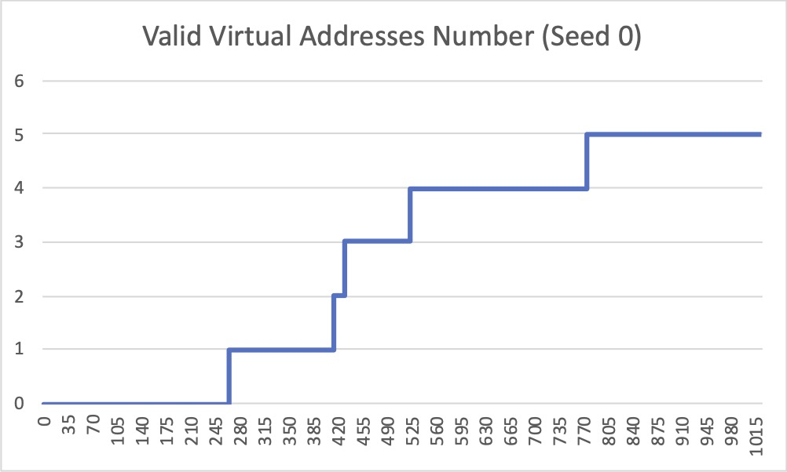
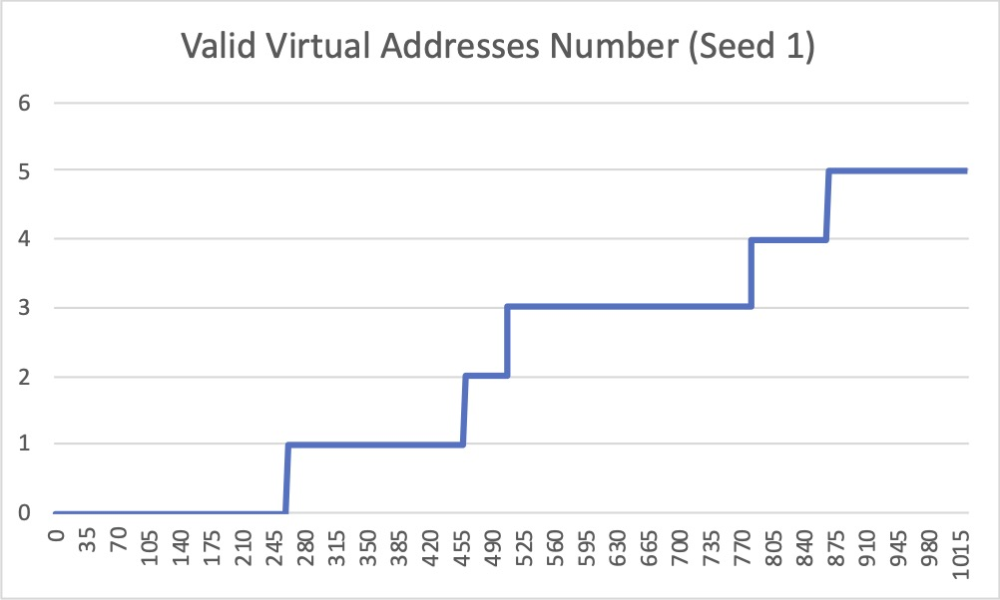
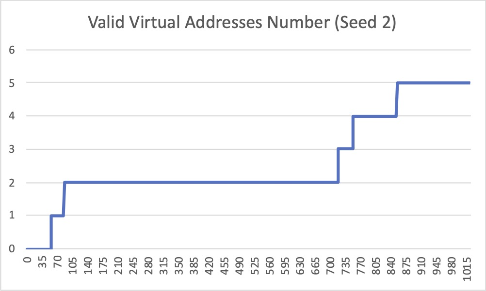
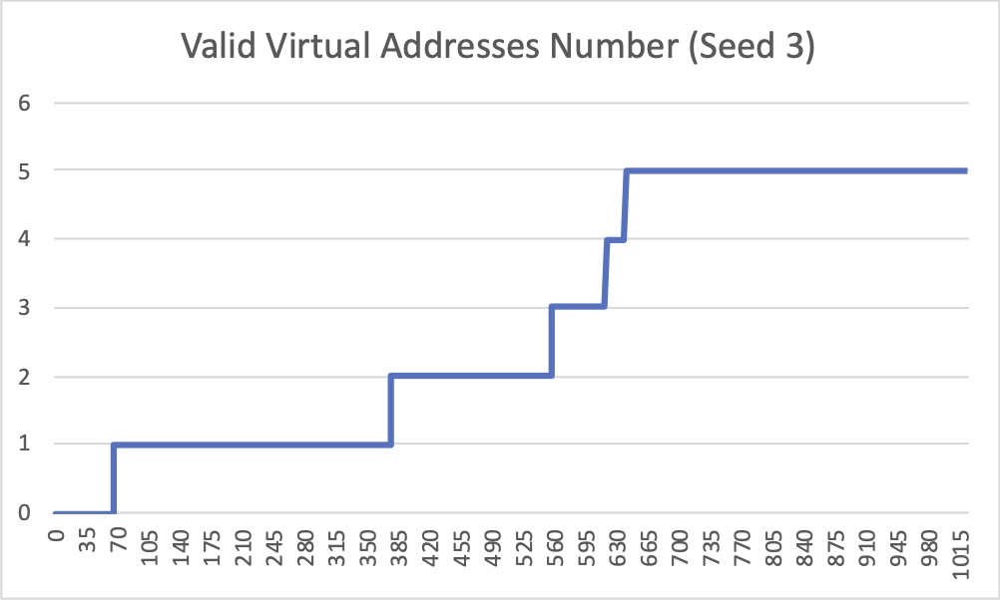
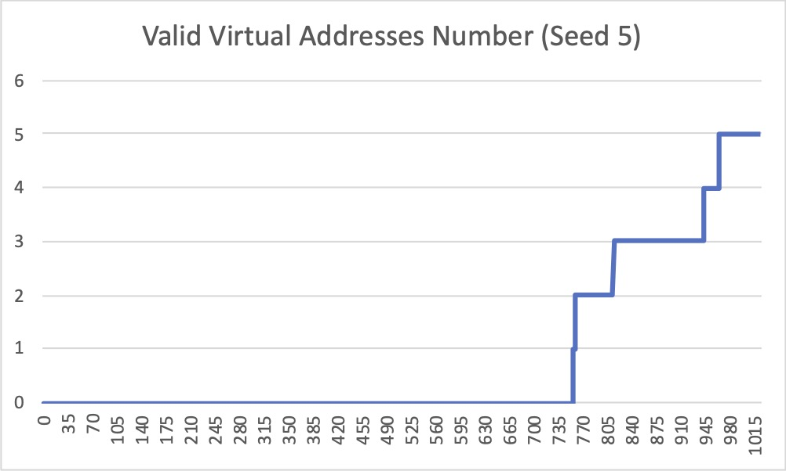

# Homework 5

## Part 1: Chapter 15 Simulation

**Q1**: Run with seeds 1, 2, and 3, and compute whether each virtual address generated by the process is in or out of bounds. If in bounds,
compute the translation.

**A**:

```zsh
ARG seed 1
ARG address space size 1k
ARG phys mem size 16k

Base-and-Bounds register information:

  Base   : 0x0000363c (decimal 13884)
  Limit  : 290

Virtual Address Trace
  VA  0: 0x0000030e (decimal:  782) --> SEGMENTATION VIOLATION
  VA  1: 0x00000105 (decimal:  261) --> VALID: 0x00003741 (decimal: 14145)
  VA  2: 0x000001fb (decimal:  507) --> SEGMENTATION VIOLATION
  VA  3: 0x000001cc (decimal:  460) --> SEGMENTATION VIOLATION
  VA  4: 0x0000029b (decimal:  667) --> SEGMENTATION VIOLATION
```

```zsh
ARG seed 2
ARG address space size 1k
ARG phys mem size 16k

Base-and-Bounds register information:

  Base   : 0x00003ca9 (decimal 15529)
  Limit  : 500

Virtual Address Trace
  VA  0: 0x00000039 (decimal:   57) --> VALID: 0x00003ce2 (decimal: 15586)
  VA  1: 0x00000056 (decimal:   86) --> VALID: 0x00003cff (decimal: 15615)
  VA  2: 0x00000357 (decimal:  855) --> SEGMENTATION VIOLATION
  VA  3: 0x000002f1 (decimal:  753) --> SEGMENTATION VIOLATION
  VA  4: 0x000002ad (decimal:  685) --> SEGMENTATION VIOLATION
```

```zsh
ARG seed 3
ARG address space size 1k
ARG phys mem size 16k

Base-and-Bounds register information:

  Base   : 0x000022d4 (decimal 8916)
  Limit  : 316

Virtual Address Trace
  VA  0: 0x0000017a (decimal:  378) --> SEGMENTATION VIOLATION
  VA  1: 0x0000026a (decimal:  618) --> SEGMENTATION VIOLATION
  VA  2: 0x00000280 (decimal:  640) --> SEGMENTATION VIOLATION
  VA  3: 0x00000043 (decimal:   67) --> VALID: 0x00002317 (decimal: 8983)
  VA  4: 0x0000000d (decimal:   13) --> VALID: 0x000022e1 (decimal: 8929)
```

---

**Q2**: Run with these flags: `-s 0 -n 10`. What value do you have set
`-l` (the bounds register) to in order to ensure that all the generated
virtual addresses are within bounds?

**A**: 930

```zsh
ARG seed 0
ARG address space size 1k
ARG phys mem size 16k

Base-and-Bounds register information:

  Base   : 0x0000360b (decimal 13835)
  Limit  : 930

Virtual Address Trace
  VA  0: 0x00000308 (decimal:  776) --> VALID: 0x00003913 (decimal: 14611)
  VA  1: 0x000001ae (decimal:  430) --> VALID: 0x000037b9 (decimal: 14265)
  VA  2: 0x00000109 (decimal:  265) --> VALID: 0x00003714 (decimal: 14100)
  VA  3: 0x0000020b (decimal:  523) --> VALID: 0x00003816 (decimal: 14358)
  VA  4: 0x0000019e (decimal:  414) --> VALID: 0x000037a9 (decimal: 14249)
  VA  5: 0x00000322 (decimal:  802) --> VALID: 0x0000392d (decimal: 14637)
  VA  6: 0x00000136 (decimal:  310) --> VALID: 0x00003741 (decimal: 14145)
  VA  7: 0x000001e8 (decimal:  488) --> VALID: 0x000037f3 (decimal: 14323)
  VA  8: 0x00000255 (decimal:  597) --> VALID: 0x00003860 (decimal: 14432)
  VA  9: 0x000003a1 (decimal:  929) --> VALID: 0x000039ac (decimal: 14764)
```

---

**Q3**: Run with these flags: `-s 1 -n 10 -l 100`. What is the maximum value that base can be set to, such that the address space still
fits into physical memory in its entirety?

**A**: The maximum value for base is 0x00003f9c (decimal 16284). Any value bigger than that will cause the address space to not fit into physical memory.

```zsh
ARG seed 0
ARG address space size 1k
ARG phys mem size 16k

Base-and-Bounds register information:

  Base   : 0x00003f9c (decimal 16284)
  Limit  : 100

Virtual Address Trace
  VA  0: 0x00000360 (decimal:  864) --> SEGMENTATION VIOLATION
  VA  1: 0x00000308 (decimal:  776) --> SEGMENTATION VIOLATION
  VA  2: 0x000001ae (decimal:  430) --> SEGMENTATION VIOLATION
  VA  3: 0x00000109 (decimal:  265) --> SEGMENTATION VIOLATION
  VA  4: 0x0000020b (decimal:  523) --> SEGMENTATION VIOLATION
  VA  5: 0x0000019e (decimal:  414) --> SEGMENTATION VIOLATION
  VA  6: 0x00000322 (decimal:  802) --> SEGMENTATION VIOLATION
  VA  7: 0x00000136 (decimal:  310) --> SEGMENTATION VIOLATION
  VA  8: 0x000001e8 (decimal:  488) --> SEGMENTATION VIOLATION
  VA  9: 0x00000255 (decimal:  597) --> SEGMENTATION VIOLATION
```

```zsh
ARG seed 0
ARG address space size 1k
ARG phys mem size 16k

Base-and-Bounds register information:

  Base   : 0x00003f9d (decimal 16285)
  Limit  : 100

Error: address space does not fit into physical memory with those base/bounds values.
Base + Limit: 16385   Psize: 16384
```

---

**Q4**: Run some of the same problems above, but with larger address
spaces (`-a`) and physical memories (`-p`).

**A**:

```zsh
$ python relocation.py -s 1 -c -a 1073741824 -p 4294967296
ARG seed 1
ARG address space size 1073741824
ARG phys mem size 4294967296

Base-and-Bounds register information:

  Base   : 0xd8f16ad9 (decimal 3639700185)
  Limit  : 304503583

Virtual Address Trace
  VA  0: 0x30e1aef0 (decimal: 820096752) --> SEGMENTATION VIOLATION
  VA  1: 0x10530d08 (decimal: 273878280) --> VALID: 0xe94477e1 (decimal: 3913578465)
  VA  2: 0x1fb5355e (decimal: 531969374) --> SEGMENTATION VIOLATION
  VA  3: 0x1cc4762b (decimal: 482637355) --> SEGMENTATION VIOLATION
  VA  4: 0x29b3b303 (decimal: 699642627) --> SEGMENTATION VIOLATION
```

```zsh
$ python relocation.py -s 2 -c -a 1073741824 -p 4294967296
ARG seed 2
ARG address space size 1073741824
ARG phys mem size 4294967296

Base-and-Bounds register information:

  Base   : 0x0e7a2682 (decimal 242886274)
  Limit  : 525068951

Virtual Address Trace
  VA  0: 0x056e8af2 (decimal: 91130610) --> VALID: 0x13e8b174 (decimal: 334016884)
  VA  1: 0x3578d049 (decimal: 897110089) --> SEGMENTATION VIOLATION
  VA  2: 0x2f1a21de (decimal: 790241758) --> SEGMENTATION VIOLATION
  VA  3: 0x2adcdce6 (decimal: 719117542) --> SEGMENTATION VIOLATION
  VA  4: 0x13b881fa (decimal: 330859002) --> VALID: 0x2232a87c (decimal: 573745276)
```

```zsh
$ python relocation.py -s 3 -c -a 1073741824 -p 4294967296
ARG seed 3
ARG address space size 1073741824
ARG phys mem size 4294967296

Base-and-Bounds register information:

  Base   : 0x8b529b44 (decimal 2337446724)
  Limit  : 332313599

Virtual Address Trace
  VA  0: 0x17ad586f (decimal: 397236335) --> SEGMENTATION VIOLATION
  VA  1: 0x26a6a03b (decimal: 648454203) --> SEGMENTATION VIOLATION
  VA  2: 0x280bcd2c (decimal: 671862060) --> SEGMENTATION VIOLATION
  VA  3: 0x04319ff4 (decimal: 70361076) --> VALID: 0x8f843b38 (decimal: 2407807800)
  VA  4: 0x00d7be8f (decimal: 14139023) --> VALID: 0x8c2a59d3 (decimal: 2351585747)
```

```zsh
$ python relocation.py -s 0 -n 10 -l 100 -a 1073741824 -p 4294967296
ARG seed 0
ARG address space size 1073741824
ARG phys mem size 4294967296

Base-and-Bounds register information:

  Base   : 0xd82c07cc (decimal 3626764236)
  Limit  : 100

Virtual Address Trace
  VA  0: 0x3082532f (decimal: 813847343) --> SEGMENTATION VIOLATION
  VA  1: 0x1aeaa510 (decimal: 451585296) --> SEGMENTATION VIOLATION
  VA  2: 0x1092178f (decimal: 278009743) --> SEGMENTATION VIOLATION
  VA  3: 0x20b8b99b (decimal: 548977051) --> SEGMENTATION VIOLATION
  VA  4: 0x19ea70df (decimal: 434794719) --> SEGMENTATION VIOLATION
  VA  5: 0x3229c18e (decimal: 841597326) --> SEGMENTATION VIOLATION
  VA  6: 0x136979c7 (decimal: 325679559) --> SEGMENTATION VIOLATION
  VA  7: 0x1e809082 (decimal: 511742082) --> SEGMENTATION VIOLATION
  VA  8: 0x2556219f (decimal: 626401695) --> SEGMENTATION VIOLATION
  VA  9: 0x3a1e8581 (decimal: 975078785) --> SEGMENTATION VIOLATION
```

---

**Q5**: What fraction of randomly-generated virtual addresses are valid, as a function of the value of the bounds register?
Make a graph from running with different random seeds, with limit values ranging from 0 up to the maximum size of the address space.

**A**: I run a [shell script](./loop.sh) to generate a series of number as the valid addresses for different limits. Then I drew line charts with Excel. Please see the charts attached.







## Part 2: Chapter 16 Simulation

**Q1**: First let’s use a tiny address space to translate some addresses. Here’s a simple set of parameters with a few different random seeds; can you translate the addresses?

**A**:

```zsh
$ python segmentation.py -a 128 -p 512 -b 0 -l 20 -B 512 -L 20 -s 0
ARG seed 0
ARG address space size 128
ARG phys mem size 512

Segment register information:

  Segment 0 base  (grows positive) : 0x00000000 (decimal 0)
  Segment 0 limit                  : 20

  Segment 1 base  (grows negative) : 0x00000200 (decimal 512)
  Segment 1 limit                  : 20

Virtual Address Trace
  VA  0: 0x0000006c (decimal:  108) --> VALID in SEG1: 0x000001ec (decimal:  492)
  VA  1: 0x00000061 (decimal:   97) --> SEGMENTATION VIOLATION (SEG1)
  VA  2: 0x00000035 (decimal:   53) --> SEGMENTATION VIOLATION (SEG0)
  VA  3: 0x00000021 (decimal:   33) --> SEGMENTATION VIOLATION (SEG0)
  VA  4: 0x00000041 (decimal:   65) --> SEGMENTATION VIOLATION (SEG1)
```

```zsh
$ python segmentation.py -a 128 -p 512 -b 0 -l 20 -B 512 -L 20 -s 1

ARG seed 1
ARG address space size 128
ARG phys mem size 512

Segment register information:

  Segment 0 base  (grows positive) : 0x00000000 (decimal 0)
  Segment 0 limit                  : 20

  Segment 1 base  (grows negative) : 0x00000200 (decimal 512)
  Segment 1 limit                  : 20

Virtual Address Trace
  VA  0: 0x00000011 (decimal:   17) --> VALID in SEG0: 0x00000011 (decimal:   17)
  VA  1: 0x0000006c (decimal:  108) --> VALID in SEG1: 0x000001ec (decimal:  492)
  VA  2: 0x00000061 (decimal:   97) --> SEGMENTATION VIOLATION (SEG1)
  VA  3: 0x00000020 (decimal:   32) --> SEGMENTATION VIOLATION (SEG0)
  VA  4: 0x0000003f (decimal:   63) --> SEGMENTATION VIOLATION (SEG0)
```

```zsh
$ python segmentation.py -a 128 -p 512 -b 0 -l 20 -B 512 -L 20 -s 2
ARG seed 2
ARG address space size 128
ARG phys mem size 512

Segment register information:

  Segment 0 base  (grows positive) : 0x00000000 (decimal 0)
  Segment 0 limit                  : 20

  Segment 1 base  (grows negative) : 0x00000200 (decimal 512)
  Segment 1 limit                  : 20

Virtual Address Trace
  VA  0: 0x0000007a (decimal:  122) --> VALID in SEG1: 0x000001fa (decimal:  506)
  VA  1: 0x00000079 (decimal:  121) --> VALID in SEG1: 0x000001f9 (decimal:  505)
  VA  2: 0x00000007 (decimal:    7) --> VALID in SEG0: 0x00000007 (decimal:    7)
  VA  3: 0x0000000a (decimal:   10) --> VALID in SEG0: 0x0000000a (decimal:   10)
  VA  4: 0x0000006a (decimal:  106) --> SEGMENTATION VIOLATION (SEG1)
```

---

**Q2**: Now, let’s see if we understand this tiny address space we’ve constructed (using the parameters from the question above). What is the highest legal virtual address in segment 0? What about the lowest legal virtual address in segment 1? What are the lowest and highest _illegal_ addresses in this entire address space? Finally, how would you run `segmentation.py` with the `-A` flag to test if you are right?

**A**: Highest legal virtual address in segment 0 is 19. Lowest legal virtual address in segment 1 is 108. Lowest illegal virtual address is 20. Highest illegal virtual address is 107.

```zsh
Virtual Address Trace
  VA  0: 0x00000013 (decimal:   19) --> VALID in SEG0: 0x00000013 (decimal:   19)

Virtual Address Trace
  VA  0: 0x00000014 (decimal:   20) --> SEGMENTATION VIOLATION (SEG0)

Virtual Address Trace
  VA  0: 0x0000006c (decimal:  108) --> VALID in SEG1: 0x000001ec (decimal:  492)

Virtual Address Trace
  VA  0: 0x0000006b (decimal:  107) --> SEGMENTATION VIOLATION (SEG1)
```

---

**Q3**: Let’s say we have a tiny 16-byte address space in a 128-byte physical memory. What base and bounds would you set up so as to get the simulator to generate the following translation results for the specified address stream: valid, valid, violation, ..., violation, valid, valid? Assume the following parameters:

**A**:

```zsh
$ python segmentation.py -a 16 -p 128 -A 0,1,2,3,4,5,6,7,8,9,10,11,12,13,14,15 -b 0 -l 2 -B 15 -L 2
ARG seed 0
ARG address space size 16
ARG phys mem size 128

Segment register information:

  Segment 0 base  (grows positive) : 0x00000000 (decimal 0)
  Segment 0 limit                  : 2

  Segment 1 base  (grows negative) : 0x0000000f (decimal 15)
  Segment 1 limit                  : 2

Virtual Address Trace
  VA  0: 0x00000000 (decimal:    0) --> VALID in SEG0: 0x00000000 (decimal:    0)
  VA  1: 0x00000001 (decimal:    1) --> VALID in SEG0: 0x00000001 (decimal:    1)
  VA  2: 0x00000002 (decimal:    2) --> SEGMENTATION VIOLATION (SEG0)
  VA  3: 0x00000003 (decimal:    3) --> SEGMENTATION VIOLATION (SEG0)
  VA  4: 0x00000004 (decimal:    4) --> SEGMENTATION VIOLATION (SEG0)
  VA  5: 0x00000005 (decimal:    5) --> SEGMENTATION VIOLATION (SEG0)
  VA  6: 0x00000006 (decimal:    6) --> SEGMENTATION VIOLATION (SEG0)
  VA  7: 0x00000007 (decimal:    7) --> SEGMENTATION VIOLATION (SEG0)
  VA  8: 0x00000008 (decimal:    8) --> SEGMENTATION VIOLATION (SEG1)
  VA  9: 0x00000009 (decimal:    9) --> SEGMENTATION VIOLATION (SEG1)
  VA 10: 0x0000000a (decimal:   10) --> SEGMENTATION VIOLATION (SEG1)
  VA 11: 0x0000000b (decimal:   11) --> SEGMENTATION VIOLATION (SEG1)
  VA 12: 0x0000000c (decimal:   12) --> SEGMENTATION VIOLATION (SEG1)
  VA 13: 0x0000000d (decimal:   13) --> SEGMENTATION VIOLATION (SEG1)
  VA 14: 0x0000000e (decimal:   14) --> VALID in SEG1: 0x0000000d (decimal:   13)
  VA 15: 0x0000000f (decimal:   15) --> VALID in SEG1: 0x0000000e (decimal:   14)
```

---

**Q4**: Assume we want to generate a problem where roughly 90% of the randomly-generated virtual addresses are valid (not segmentation violations). How should you configure the simulator to do so?  Which parameters are important to getting this outcome?

**A**: Make about 90% of the address space valid. The most important parameter are base and limit of both segments.

```zsh
$ python segmentation.py -a 128 -p 256 -n 10 -b 0 -l 60 -B 128 -L 60 -s 1
ARG seed 1
ARG address space size 128
ARG phys mem size 256

Segment register information:

  Segment 0 base  (grows positive) : 0x00000000 (decimal 0)
  Segment 0 limit                  : 60

  Segment 1 base  (grows negative) : 0x00000080 (decimal 128)
  Segment 1 limit                  : 60

Virtual Address Trace
  VA  0: 0x00000011 (decimal:   17) --> VALID in SEG0: 0x00000011 (decimal:   17)
  VA  1: 0x0000006c (decimal:  108) --> VALID in SEG1: 0x0000006c (decimal:  108)
  VA  2: 0x00000061 (decimal:   97) --> VALID in SEG1: 0x00000061 (decimal:   97)
  VA  3: 0x00000020 (decimal:   32) --> VALID in SEG0: 0x00000020 (decimal:   32)
  VA  4: 0x0000003f (decimal:   63) --> SEGMENTATION VIOLATION (SEG0)
  VA  5: 0x00000039 (decimal:   57) --> VALID in SEG0: 0x00000039 (decimal:   57)
  VA  6: 0x00000053 (decimal:   83) --> VALID in SEG1: 0x00000053 (decimal:   83)
  VA  7: 0x00000064 (decimal:  100) --> VALID in SEG1: 0x00000064 (decimal:  100)
  VA  8: 0x0000000c (decimal:   12) --> VALID in SEG0: 0x0000000c (decimal:   12)
  VA  9: 0x00000003 (decimal:    3) --> VALID in SEG0: 0x00000003 (decimal:    3)
```

---

**Q5**:  Can you run the simulator such that no virtual addresses are valid? How?

**A**: Yes. Just make none of the address space valid.

```zsh
$ python segmentation.py -a 128 -p 256 -n 10 -b 128 -l 1 -B 129 -L 1 -s 1
ARG seed 1
ARG address space size 128
ARG phys mem size 256

Segment register information:

  Segment 0 base  (grows positive) : 0x00000080 (decimal 128)
  Segment 0 limit                  : 1

  Segment 1 base  (grows negative) : 0x00000081 (decimal 129)
  Segment 1 limit                  : 1

Virtual Address Trace
  VA  0: 0x00000011 (decimal:   17) --> SEGMENTATION VIOLATION (SEG0)
  VA  1: 0x0000006c (decimal:  108) --> SEGMENTATION VIOLATION (SEG1)
  VA  2: 0x00000061 (decimal:   97) --> SEGMENTATION VIOLATION (SEG1)
  VA  3: 0x00000020 (decimal:   32) --> SEGMENTATION VIOLATION (SEG0)
  VA  4: 0x0000003f (decimal:   63) --> SEGMENTATION VIOLATION (SEG0)
  VA  5: 0x00000039 (decimal:   57) --> SEGMENTATION VIOLATION (SEG0)
  VA  6: 0x00000053 (decimal:   83) --> SEGMENTATION VIOLATION (SEG1)
  VA  7: 0x00000064 (decimal:  100) --> SEGMENTATION VIOLATION (SEG1)
  VA  8: 0x0000000c (decimal:   12) --> SEGMENTATION VIOLATION (SEG0)
  VA  9: 0x00000003 (decimal:    3) --> SEGMENTATION VIOLATION (SEG0)
```

## Part 3: Chapter 17 Simulation

**Q1**:

**A**:

---
