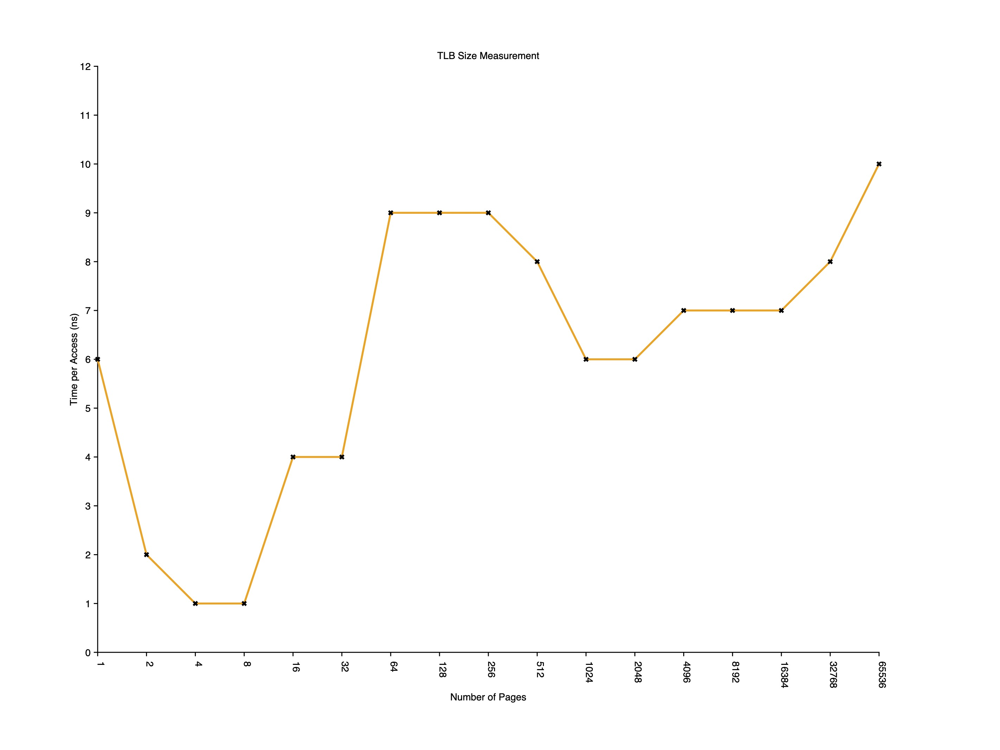

# Homework 6

## Part 1: Chapter 18 Simulation

**Q1**: Before doing any translations, let’s use the simulator to study how
linear page tables change size given different parameters. Compute
the size of linear page tables as different parameters change. Some
suggested inputs are below; by using the `-v` flag, you can see
how many page-table entries are filled. First, to understand how
linear page table size changes as the address space grows, run with
these flags:

```zsh
-P 1k -a 1m -p 512m -v -n 0
-P 1k -a 2m -p 512m -v -n 0
-P 1k -a 4m -p 512m -v -n 0
```

Then, to understand how linear page table size changes as page size
grows:

```zsh
-P 1k -a 1m -p 512m -v -n 0
-P 2k -a 1m -p 512m -v -n 0
-P 4k -a 1m -p 512m -v -n 0
```

Before running any of these, try to think about the expected trends.
How should page-table size change as the address space grows? As
the page size grows? Why not use big pages in general?

**A**: Because big pages are not flexible enough. If the page size is too big, there could be only a few users get a page before it runs out of space.

---

**Q2**: Now let’s do some translations. Start with some small examples,
and change the number of pages that are allocated to the address
space with the `-u` flag. For example:

```zsh
-P 1k -a 16k -p 32k -v -u 0
-P 1k -a 16k -p 32k -v -u 25
-P 1k -a 16k -p 32k -v -u 50
-P 1k -a 16k -p 32k -v -u 75
-P 1k -a 16k -p 32k -v -u 100
```

What happens as you increase the percentage of pages that are allocated in each address space?

**A**: The number of invalid pages decreases.

---

**Q3**: Now let’s try some different random seeds, and some different (and
sometimes quite crazy) address-space parameters, for variety:

```zsh
-P 8 -a 32 -p 1024 -v -s 1
-P 8k -a 32k -p 1m -v -s 2
-P 1m -a 256m -p 512m -v -s 3
```

Which of these parameter combinations are unrealistic? Why?

**A** The third one as the address space is too large comparing to the physical memory.

---

**Q4**: Use the program to try out some other problems. Can you find the
limits of where the program doesn’t work anymore? For example,
what happens if the address-space size is bigger than physical memory?

**A**: It won't work as the physical memory size must be GREATER than address space size.

## Part 2: Chapter 19 Measurement

**Q1**: For timing, you’ll need to use a timer (e.g., `gettimeofday()`).  How precise is such a timer? How long does an operation have to take in order for you to time it precisely? (this will help determine how many times, in a loop, you’ll have to repeat a page access in order to time it successfully)

**A**: I use `rdstc` on the Intel platform and `cntfrq` on the ARM platform. Both of them can provide cycle-level precision. The operation should be longer than a couple of nanoseconds.

---

**Q2**: Write the program, called `tlb.c`, that can roughly measure the cost of accessing each page. Inputs to the program should be: the number of pages to touch and the number of trials.

**A**: Please see the code in [tlb.c](./tlb.c).

---

**Q3**: Now write a script in your favorite scripting language (bash?) to run this program, while varying the number of pages accessed from 1 up to a few thousand, perhaps incrementing by a factor of two per iteration. Run the script on different machines and gather some data. How many trials are needed to get reliable measurements?

**A**: I use 1000 as the number of trials. But the page number also matters.

---

**Q4**: Next, graph the results, making a graph that looks similar to the one above. Use a good tool like `ploticus` or even `zplot`. Visualization usually makes the data much easier to digest; why do you think that is?

**A**: I use `zplot` to draw the output. Result after 64 pages tends to be stable. 

---

**Q5**: One thing to watch out for is compiler optimization. Compilers do all sorts of clever things, including removing loops which increment values that no other part of the program subsequently uses. How can you ensure the compiler does not remove the main loop above from your TLB size estimator?

**A**: I disable the compiler optimization and build my program with debug enabled. You can check the disassembly of your program to see if the compiler did clever things you don't like with tools like `otool` or even `gdb`.

---

**Q6**: Another thing to watch out for is the fact that most systems today ship with multiple CPUs, and each CPU, of course, has its own TLB hierarchy. To really get good measurements, you have to run your code on just one CPU, instead of letting the scheduler bounce it from one CPU to the next. How can you do that? (hint: look up “pinning a thread” on Google for some clues) What will happen if you don’t do this, and the code moves from one CPU to the other?

**A**: We can use `sched_setaffinity` system call to pin our process (main thread) to a specific CPU core on Linux.

---

**Q7**: Another issue that might arise relates to initialization. If you don’t initialize the array a above before accessing it, the first time you access it will be very expensive, due to initial access costs such as demand zeroing. Will this affect your code and its timing? What can you do to counterbalance these potential costs?

**A**: I'm not aware of any demand zeroing costs with a dynamically allocated array in C. But you can always zero it out manually before starting the measurement.
